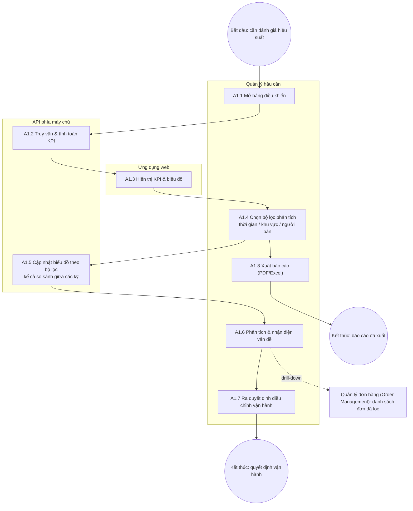
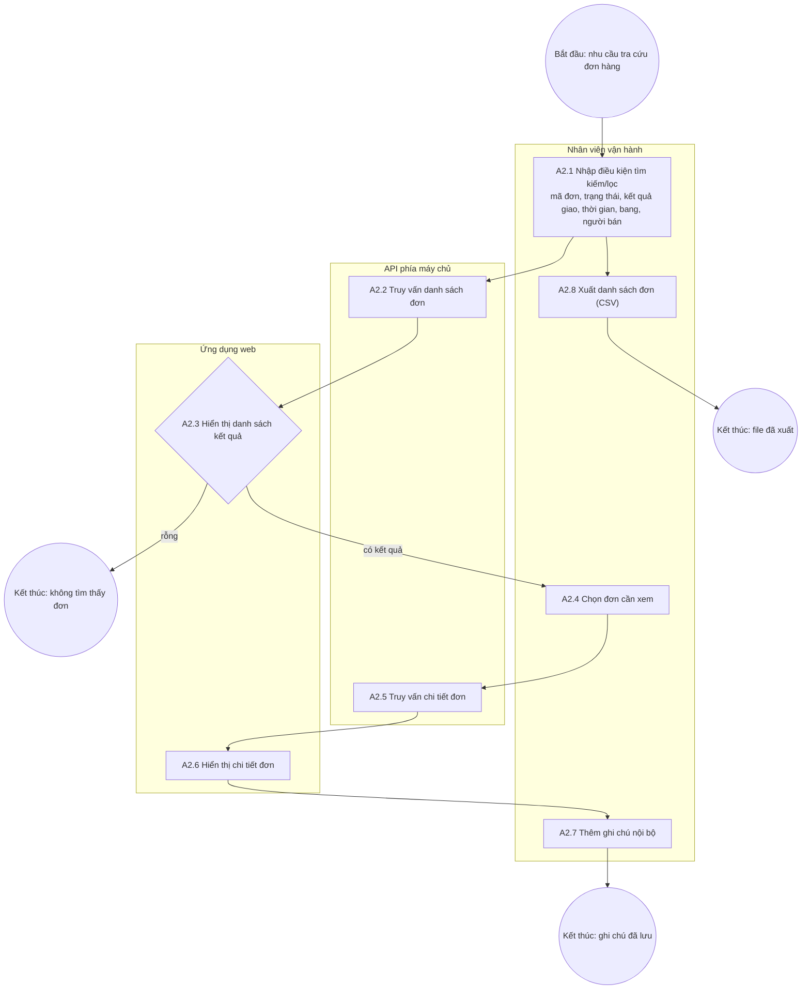
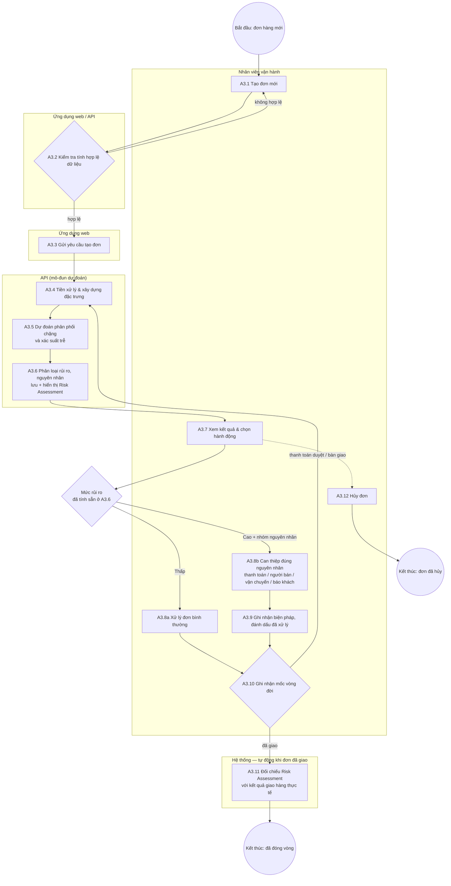

# Phân tích quy trình nghiệp vụ — Ship Guard

Áp dụng khung phân loại quy trình BPM (Business Process Management) vào phạm vi dự án, để làm rõ Ship Guard đang phục vụ/thay thế quy trình vận hành nào — không chỉ là danh sách tính năng.

## 0. Khung phân loại

Theo mô hình Chuỗi giá trị (Value Chain), quy trình nghiệp vụ chia làm 3 nhóm:

| Nhóm | Bản chất | Khách hàng phục vụ |
| --- | --- | --- |
| **Cốt lõi (Core)** | Tạo ra và giao giá trị trực tiếp | Khách hàng bên ngoài — cảm nhận ngay nếu quy trình gặp sự cố |
| **Hỗ trợ (Support)** | Cung cấp nguồn lực để quy trình cốt lõi vận hành trơn tru | Nội bộ — khách hàng ngoài không thấy |
| **Quản lý (Management)** | Đo lường, giám sát, định hướng | Ban lãnh đạo/quản lý |

Một chuỗi công việc chỉ tính là "quy trình nghiệp vụ" khi có đủ: sự kiện kích hoạt (trigger), input/output tạo giá trị, các bước tuần tự kèm điểm quyết định, và actor/tài nguyên thực thi rõ ràng.

## 1. Tổng quan nghiệp vụ

Ứng dụng phục vụ nghiệp vụ **giám sát và quản lý rủi ro giao hàng** trong hậu cần. Người dùng là **nhân viên vận hành** và **quản lý hậu cần**. Mọi người dùng phải đăng nhập. Hệ thống khởi tạo sẵn đúng một tài khoản **Super Admin** từ cấu hình cài đặt; Super Admin tạo các tài khoản quản lý hậu cần, và quản lý hậu cần tạo tiếp các tài khoản khác. Mọi vai trò dùng chung toàn bộ nghiệp vụ; riêng nhân viên vận hành không quản trị được tài khoản. Có 3 nghiệp vụ chính:

1. **Giám sát hiệu suất giao hàng** — theo dõi KPI để đánh giá chất lượng vận hành.
2. **Tra cứu và quản lý đơn hàng** — tìm kiếm, xem trạng thái đơn.
3. **Đánh giá rủi ro giao trễ** — dự đoán trước khi đơn được giao để can thiệp sớm (nghiệp vụ lõi).

Cả 3 quy trình vận hành trên nền vòng đời đơn hàng thực tế: khách đặt hàng → thanh toán được xác nhận → người bán chuẩn bị và đóng gói hàng → hàng được bàn giao cho đơn vị vận chuyển → đơn vị vận chuyển giao hàng đến khách → khách được mời đánh giá trải nghiệm. Một đơn được coi là **trễ** khi ngày giao hàng thực tế muộn hơn ngày giao hàng dự kiến đã cam kết với khách. So sánh này thực hiện ở mức **ngày lịch**: ngày dự kiến là một ngày cam kết chứ không phải một thời điểm cụ thể, nên đơn giao đúng ngày đã hứa được tính là **đúng hạn**, bất kể mấy giờ.

## 2. Quy trình 1: Giám sát hiệu suất (Performance Monitoring)

- **Tác nhân:** Quản lý hậu cần
- **Đầu vào:** Dữ liệu đơn hàng lịch sử, dữ liệu đánh giá của khách hàng
- **Đầu ra:** Báo cáo KPI, quyết định điều chỉnh vận hành

**Mô tả quy trình:** Quản lý đăng nhập và mở bảng điều khiển tổng quan → hệ thống truy vấn dữ liệu, tính toán và hiển thị bộ KPI gồm: tỷ lệ giao đúng hạn, số đơn trễ, **ba chặng thời gian tách riêng theo trách nhiệm** — thời gian chờ duyệt thanh toán (từ lúc đặt hàng đến lúc thanh toán được xác nhận), thời gian người bán chuẩn bị hàng (từ lúc thanh toán được xác nhận đến lúc bàn giao cho đơn vị vận chuyển), thời gian vận chuyển (từ lúc bàn giao đến lúc khách nhận hàng), mỗi chặng báo cáo bằng **trung vị kèm phân vị 90** chứ không phải trung bình cộng — **tỷ lệ đánh giá thấp có liên quan đến giao trễ** (trong các đơn bị khách chấm 1–2 sao, bao nhiêu phần trăm là đơn giao trễ), phân bố theo vùng (**bang của khách hàng nhận hàng**), xu hướng theo thời gian → quản lý chọn bộ lọc (khoảng thời gian, khu vực, **người bán**) để phân tích sâu → hệ thống cập nhật biểu đồ theo bộ lọc, **kể cả so sánh giữa các kỳ (kỳ này so với kỳ trước hoặc cùng kỳ năm trước) khi được chọn** → quản lý nhận diện vấn đề (ví dụ: vùng X có tỷ lệ trễ cao, hoặc thời gian xử lý của người bán kéo dài bất thường trong một giai đoạn) và ra quyết định điều chỉnh. Quản lý cũng có thể **xuất báo cáo (PDF/Excel)** từ trạng thái bảng điều khiển đã lọc, hoặc **nhảy sang [Quản lý đơn hàng (Order Management)](#3-quy-trình-2-quản-lý-đơn-hàng-order-management)** (danh sách đơn đã lọc sẵn) khi click vào một điểm bất thường trên biểu đồ. **Xuất báo cáo (A1.8) chưa được triển khai.** **Drill-down (A1.6) được triển khai cùng [Quản lý đơn hàng (Order Management)](#3-quy-trình-2-quản-lý-đơn-hàng-order-management)**: click một điểm trên biểu đồ xu hướng tỷ lệ trễ hoặc một bang trên biểu đồ theo bang sẽ mở danh sách các đơn trễ đã giao trong đúng khoảng đó, mang theo bộ lọc bang và người bán đang áp dụng — số đơn trong danh sách khớp đúng con số trên biểu đồ.

Việc tách vòng đời đơn thành ba chặng giúp quản lý xác định chính xác điểm nghẽn thuộc về ai: cổng thanh toán và ngân hàng, người bán, hay đơn vị vận chuyển. Nếu gộp thời gian chờ duyệt thanh toán vào thời gian của người bán, một đơn chậm vì ngân hàng sẽ bị quy oan cho người bán. Việc dùng trung vị kèm phân vị 90 thay cho trung bình cộng là vì cả ba chặng đều lệch đuôi mạnh — một nhúm đơn cá biệt kéo trung bình lệch xa giá trị điển hình. Việc đưa thêm tỷ lệ đánh giá thấp liên quan đến trễ vào bộ KPI giúp gắn hiệu suất vận hành nội bộ với trải nghiệm thực tế của khách hàng. Bộ lọc theo người bán, so sánh giữa các kỳ, xuất báo cáo và drill-down sang [Quản lý đơn hàng (Order Management)](#3-quy-trình-2-quản-lý-đơn-hàng-order-management) là các mở rộng giúp quản lý đi từ nhìn thấy vấn đề đến hành động nhanh hơn, tận dụng dữ liệu KPI đã có sẵn.

| # | Hoạt động | Tài nguyên thực hiện | Đầu vào | Đầu ra |
| --- | --- | --- | --- | --- |
| A1.1 | Mở bảng điều khiển | Quản lý hậu cần | — | Yêu cầu xem bảng điều khiển |
| A1.2 | Truy vấn & tính toán KPI (gồm ba chặng thời gian, mỗi chặng lấy trung vị và phân vị 90) | API phía máy chủ | Dữ liệu đơn hàng lịch sử, dữ liệu đánh giá khách hàng | Bộ chỉ số KPI |
| A1.3 | Hiển thị KPI & biểu đồ | Ứng dụng web | Bộ chỉ số KPI | Bảng điều khiển trực quan |
| A1.4 | Chọn bộ lọc phân tích (thời gian — theo ngày giao thực tế, khu vực — bang của khách hàng, người bán) | Quản lý hậu cần | Bảng điều khiển | Điều kiện lọc |
| A1.5 | Cập nhật biểu đồ theo bộ lọc (kể cả so sánh giữa các kỳ) | API + Ứng dụng web | Điều kiện lọc | Biểu đồ đã lọc |
| A1.6 | Phân tích & nhận diện vấn đề | Quản lý hậu cần | Biểu đồ đã lọc | Nhận định vấn đề; hoặc điều hướng sang [Quản lý đơn hàng (Order Management)](#3-quy-trình-2-quản-lý-đơn-hàng-order-management) với bộ lọc ngày giao, bang, người bán tương ứng và kết quả giao = trễ |
| A1.7 | Ra quyết định điều chỉnh vận hành | Quản lý hậu cần | Nhận định vấn đề | Quyết định điều chỉnh |
| A1.8 | Xuất báo cáo — _chưa triển khai_ | Quản lý hậu cần | Bảng điều khiển đã lọc | File báo cáo (PDF/Excel) |

**Sự kiện:** bắt đầu — quản lý cần đánh giá hiệu suất (theo nhu cầu hoặc định kỳ); trung gian — dữ liệu KPI được trả về từ API; kết thúc — quyết định vận hành được đưa ra, hoặc báo cáo được xuất ra.

**Đối tượng nghiệp vụ:** Báo cáo hiệu suất (được tạo → được phân tích → dẫn đến quyết định); Dữ liệu đơn hàng lịch sử và dữ liệu đánh giá khách hàng (kho dữ liệu); Bộ chỉ số KPI (tỷ lệ đúng hạn, số đơn trễ, ba chặng thời gian — chờ duyệt thanh toán, người bán chuẩn bị hàng, vận chuyển — mỗi chặng có trung vị và phân vị 90, tỷ lệ đánh giá thấp do trễ, phân bố theo bang khách hàng, xu hướng); Điều kiện lọc; File báo cáo (PDF/Excel).

**Định hướng mở rộng:**

- **Dự báo xu hướng khối lượng đơn theo mùa vụ** (cảnh báo trước cao điểm tháng 10–11) — cần một mô hình dự báo riêng, hiện chưa có mô tả kỹ thuật nào cho việc này.
- **Đóng vòng đánh giá can thiệp vận hành** (ghi nhận quyết định A1.7 + so sánh KPI trước/sau, cảnh báo chủ động theo ngưỡng KPI) — nối tiếp cơ chế đóng vòng đã thiết kế ở Quy trình 3 (mục 4, A3.9–A3.11), nhưng chỉ nên triển khai sau khi có kinh nghiệm thực tế từ [Dự đoán rủi ro giao trễ (Risk Prediction)](#4-quy-trình-3-dự-đoán-rủi-ro-giao-trễ-risk-prediction): quy kết một biến động KPI tổng thể cho một quyết định vận hành đơn lẻ khó hơn nhiều so với đối chiếu một nhãn dự đoán với một đơn hàng cụ thể (nhiễu bởi nhiều yếu tố cùng lúc), và ngưỡng cảnh báo KPI hợp lý chưa có cơ sở dữ liệu để xác định.

## 3. Quy trình 2: Quản lý đơn hàng (Order Management)

- **Tác nhân:** Nhân viên vận hành
- **Đầu vào:** Yêu cầu tra cứu (mã đơn, trạng thái vòng đời, kết quả giao, ngày đặt hàng, ngày giao thực tế, bang khách hàng, người bán)
- **Đầu ra:** Thông tin chi tiết đơn hàng

**Phạm vi:** quy trình này không thay đổi dữ liệu đơn hàng — tạo đơn mới, ghi nhận mốc và hủy đơn thuộc [Dự đoán rủi ro giao trễ (Risk Prediction)](#4-quy-trình-3-dự-đoán-rủi-ro-giao-trễ-risk-prediction). Thao tác ghi duy nhất ở đây là **thêm ghi chú nội bộ** — chỉ thêm được, không sửa hay xóa, luôn gắn với tài khoản người viết. **Bộ lọc mức rủi ro, trạng thái xử lý và khối Risk Assessment ở trang chi tiết** được triển khai cùng Quy trình 3.

**Mô tả quy trình:** Nhân viên mở trang quản lý đơn, tìm theo vài ký tự đầu của mã đơn hoặc lọc theo trạng thái vòng đời, kết quả giao (đúng hạn / trễ / chưa có kết quả), ngày đặt hàng, ngày giao thực tế, bang khách hàng, người bán, mức rủi ro, trạng thái xử lý → hệ thống trả về danh sách đơn phù hợp kèm tổng số, phân trang, hoặc **thông báo "không tìm thấy đơn" nếu danh sách rỗng** → nhân viên chọn một đơn để xem chi tiết → hệ thống hiển thị dòng thời gian của đơn và ba chặng thời gian, sản phẩm kèm giá và phí vận chuyển, người bán, địa chỉ giao, thanh toán, đánh giá của khách, trạng thái đúng hạn/trễ, và khối Risk Assessment kèm lịch sử nếu đơn có → nhân viên có thể **thêm ghi chú nội bộ** vào đơn, hoặc **xuất toàn bộ danh sách đơn đã lọc ra file CSV**.

| # | Hoạt động | Tài nguyên thực hiện | Đầu vào | Đầu ra |
| --- | --- | --- | --- | --- |
| A2.1 | Nhập điều kiện tìm kiếm/lọc (mã đơn, trạng thái vòng đời, kết quả giao, ngày đặt, ngày giao, bang, người bán, mức rủi ro, trạng thái xử lý) | Nhân viên vận hành | Nhu cầu tra cứu | Điều kiện truy vấn |
| A2.2 | Truy vấn danh sách đơn | API phía máy chủ | Điều kiện truy vấn | Danh sách đơn phù hợp (có thể rỗng) |
| A2.3 | Hiển thị danh sách kết quả, hoặc thông báo không tìm thấy đơn | Ứng dụng web | Danh sách đơn | Bảng đơn hàng trên giao diện, hoặc thông báo rỗng |
| A2.4 | Chọn đơn cần xem | Nhân viên vận hành | Bảng đơn hàng | Mã đơn được chọn |
| A2.5 | Truy vấn chi tiết đơn | API phía máy chủ | Mã đơn | Dữ liệu chi tiết đơn |
| A2.6 | Hiển thị chi tiết đơn (dòng thời gian, sản phẩm, người bán, địa chỉ, thanh toán, đánh giá, khối Risk Assessment kèm lịch sử) | Ứng dụng web | Dữ liệu chi tiết | Trang chi tiết đơn |
| A2.7 | Thêm ghi chú nội bộ | Nhân viên vận hành | Trang chi tiết đơn, nội dung ghi chú | Ghi chú được lưu vào đơn kèm người viết và thời điểm |
| A2.8 | Xuất danh sách đơn ra file | Nhân viên vận hành | Danh sách đơn đã lọc | File CSV |

**Sự kiện:** bắt đầu — phát sinh nhu cầu tra cứu đơn hàng; trung gian — kết quả truy vấn được trả về (có thể rỗng); kết thúc — nhân viên nhận được thông tin đơn cần tìm, hoặc đã xuất file.

**Đối tượng nghiệp vụ:** Đơn hàng (được tra cứu → được xem chi tiết); Điều kiện tìm kiếm; Danh sách đơn; Chi tiết đơn (sản phẩm, người bán, địa chỉ, dòng thời gian, thanh toán, đánh giá, trạng thái); Ghi chú nội bộ (gắn với người viết); File CSV danh sách đơn.

**Định hướng mở rộng:**

- **Lịch sử thay đổi trạng thái đơn (audit trail)** — cần một mô hình dữ liệu log riêng (ai đổi gì, khi nào) chưa được thiết kế.
- **Nhắc việc tự động khi có đơn rủi ro cao chưa xử lý sau một khoảng thời gian** — nối tiếp trạng thái "đã xử lý/chưa xử lý" đã có (A3.6, A3.9), nhưng thiếu một tham số cụ thể: khoảng thời gian bao lâu thì nhắc, hiện chưa có cơ sở nào để quyết định con số này.

## 4. Quy trình 3: Dự đoán rủi ro giao trễ (Risk Prediction)

- **Tác nhân:** Nhân viên vận hành (quản lý hậu cần xem thêm chỉ số mô hình)
- **Đầu vào:** Thông tin đơn hàng mới (người bán, từng dòng sản phẩm — danh mục, cân nặng, giá, phí vận chuyển —, địa chỉ giao, các dòng thanh toán, thời điểm đặt hàng, ngày giao cam kết); các mốc vòng đời được ghi nhận dần
- **Đầu ra:** Mỗi mốc một Risk Assessment — xác suất trễ, mức rủi ro cao/thấp, nhóm nguyên nhân rủi ro chính (chờ duyệt thanh toán, người bán chuẩn bị hàng, hoặc vận chuyển); biện pháp can thiệp đã ghi nhận; kết quả đối chiếu với thực tế

**Mô tả quy trình:** Nhân viên **tạo đơn mới** trong biểu mẫu — đơn là một đơn hàng đầy đủ nối tiếp dữ liệu lịch sử, hiện trong [Quản lý đơn hàng (Order Management)](#3-quy-trình-2-quản-lý-đơn-hàng-order-management) và được tính vào KPI khi đã giao — gồm một hoặc nhiều người bán có sẵn, từng dòng sản phẩm, địa chỉ giao, một hoặc nhiều dòng **thanh toán** (thanh toán qua thẻ tín dụng có thể phải chờ ngân hàng xác nhận trước khi đơn được xử lý, nên cũng là một yếu tố rủi ro), **thời điểm đặt hàng** (mặc định là lúc tạo, sửa được về quá khứ nhưng không ở tương lai — để nhận diện các mùa cao điểm như tháng 10–11, khi khối lượng đơn tăng đột biến) và ngày giao cam kết → hệ thống kiểm tra tính hợp lệ → API dự đoán **thời gian của từng chặng chưa xảy ra** dưới dạng phân phối: chờ duyệt thanh toán, người bán chuẩn bị hàng (dự đoán cho từng người bán, đơn chờ người chậm nhất), vận chuyển (theo **cặp vùng gửi–nhận cụ thể** — thực tế tuyến từ Paraná đến Distrito Federal giao dưới 10 ngày, trong khi tuyến từ Minas Gerais đến Rio Grande do Sul hoặc đến Paraná có thể mất hơn 40 ngày, và các bang Roraima/Amapá có độ trễ trung bình cao nhất) → từ đó tính **xác suất tổng thời gian vượt ngày cam kết** → **hệ thống tự động phân loại mức rủi ro cao/thấp theo ngưỡng lấy từ kết quả đánh giá mô hình, xác định nguyên nhân chính là chặng dự kiến vượt mức thường nhiều ngày nhất, lưu thành một Risk Assessment gắn với đơn rồi hiển thị** → nhân viên xem kết quả và chọn hành động: rủi ro thấp → xử lý đơn bình thường; rủi ro cao → can thiệp **đúng theo nguyên nhân** (liên hệ về thanh toán, nhắc/ưu tiên người bán, đổi đơn vị vận chuyển, hoặc chủ động thông báo khách hàng), sau đó **ghi nhận biện pháp đã làm và đánh dấu "đã xử lý"** → khi đơn đi tiếp, nhân viên **ghi nhận từng mốc** (thanh toán được duyệt, bàn giao cho đơn vị vận chuyển): mỗi mốc sinh một Risk Assessment mới, chặng đã xong dùng thời gian thật; các lần cũ giữ làm lịch sử, và nếu lần mới vẫn rủi ro cao thì đó là một việc cần xử lý mới → khi nhân viên ghi nhận đơn **đã giao**, **hệ thống tự động đối chiếu mọi Risk Assessment của đơn với kết quả giao hàng thực tế**, khép lại vòng đánh giá. Đơn bị hủy trước khi giao thì ngừng đánh giá và không đối chiếu. Quản lý hậu cần xem **độ tin cậy của mô hình** trên một trang chỉ số: kết quả đánh giá lúc huấn luyện và tỷ lệ đúng/sai tích lũy từ các lần đối chiếu.

> **Quyết định:** phân loại mức rủi ro cao/thấp do **hệ thống tự động thực hiện** theo một ngưỡng chung cho mọi mốc, khác với thiết kế ban đầu vốn giao việc đánh giá này cho nhân viên vận hành. Ngưỡng không cố định 50% như bản trước: tỷ lệ trễ nền chỉ khoảng 6,8%, nên ở mốc đặt hàng gần như không đơn nào vượt 50%. Ngưỡng là mức cho F1 cao nhất trên dữ liệu kiểm định, đặt trong cấu hình.
>
> **Quyết định:** kết quả dự đoán được lưu thành **lịch sử các Risk Assessment gắn với đơn** (không phải phép tính thử-rồi-quên), mỗi lần có trạng thái xử lý riêng — điều kiện cần để đóng vòng đánh giá can thiệp rủi ro (A3.9–A3.11).
>
> **Quyết định:** Ship Guard là nơi **ghi nhận đơn mới**. Dữ liệu Olist lịch sử chỉ dùng để huấn luyện và không bao giờ được dự đoán; đơn lịch sử còn dang dở giữ nguyên, chỉ đọc (ADR-0007).
>
> **Quyết định:** mô hình dự đoán **phân phối thời gian ba chặng** thay vì trực tiếp nhãn trễ/đúng hạn, để một bộ mô hình phục vụ mọi mốc và nguyên nhân luôn khớp với xác suất (ADR-0008). Ba thuật toán ứng viên được huấn luyện; giữ thuật toán có F1 cao nhất ở mốc đặt hàng, mục tiêu F1 ≥ 0,30. Chưa đạt vẫn triển khai và hiển thị rõ là chưa đạt. Mô hình chạy trong backend (ADR-0009).

Việc phân tách nguyên nhân rủi ro theo ba chặng là cải tiến quan trọng so với việc chỉ dự đoán một nhãn "trễ" chung — nếu không phân tách, nhân viên vận hành có thể chọn sai biện pháp can thiệp (ví dụ đổi đơn vị vận chuyển trong khi lỗi thực chất nằm ở người bán chuẩn bị hàng chậm, hoặc quy cho người bán một đơn chậm vì ngân hàng chưa duyệt thanh toán).

| # | Hoạt động | Tài nguyên thực hiện | Đầu vào | Đầu ra |
| --- | --- | --- | --- | --- |
| A3.1 | Tạo đơn mới | Nhân viên vận hành | Thông tin đơn thực tế (người bán, sản phẩm, địa chỉ, thanh toán, thời điểm đặt hàng, ngày cam kết) | Bộ tham số đầu vào |
| A3.2 | Kiểm tra tính hợp lệ dữ liệu | Ứng dụng web / API | Bộ tham số đầu vào | Dữ liệu hợp lệ (hoặc báo lỗi) |
| A3.3 | Gửi yêu cầu tạo đơn | Ứng dụng web | Dữ liệu hợp lệ | Yêu cầu đến API |
| A3.4 | Tiền xử lý & xây dựng đặc trưng | API (mô-đun dự đoán) | Đơn và các mốc đã có | Vec-tơ đặc trưng cho từng chặng chưa xảy ra (gồm cặp vùng gửi–nhận, hình thức thanh toán, mùa vụ, lịch sử người bán, khoảng cam kết) |
| A3.5 | Dự đoán phân phối thời gian chặng và xác suất trễ | API (mô-đun dự đoán) | Vec-tơ đặc trưng, thời gian thật của chặng đã xong | Phân phối các chặng + xác suất trễ |
| A3.6 | Phân loại mức rủi ro, xác định nguyên nhân, lưu và hiển thị Risk Assessment | API + Ứng dụng web | Xác suất trễ + phân phối các chặng | Risk Assessment lưu vào đơn, hiển thị trên giao diện |
| A3.7 | Xem kết quả & chọn hành động | Nhân viên vận hành | Risk Assessment trên giao diện | Quyết định hành động |
| A3.8a | Xử lý đơn bình thường | Nhân viên vận hành | Quyết định (rủi ro thấp) | Đơn vào luồng thường |
| A3.8b | Thực hiện biện pháp can thiệp đúng nguyên nhân | Nhân viên vận hành | Quyết định (rủi ro cao) kèm nhóm nguyên nhân | Đơn được ưu tiên xử lý / đổi vận chuyển / liên hệ thanh toán / thông báo khách |
| A3.9 | Ghi nhận biện pháp và đánh dấu đã xử lý | Nhân viên vận hành | Risk Assessment rủi ro cao mới nhất đã can thiệp | Risk Assessment → "đã xử lý", kèm biện pháp và ghi chú |
| A3.10 | Ghi nhận mốc vòng đời (sửa được mốc mới nhất khi chưa giao) | Nhân viên vận hành | Đơn chưa giao, mốc kế tiếp và thời điểm | Mốc được lưu, trạng thái đơn cập nhật; thanh toán duyệt / bàn giao → quay lại A3.4; đã giao → A3.11 |
| A3.11 | Đối chiếu Risk Assessment với kết quả giao hàng thực tế | Hệ thống (tự động, khi ghi nhận đã giao) | Mọi Risk Assessment của đơn, ngày giao thực tế | Kết quả đối chiếu (đúng/sai) gắn vào từng Risk Assessment |
| A3.12 | Hủy đơn | Nhân viên vận hành | Đơn chưa giao | Đơn "đã hủy", không còn việc cần xử lý, không đối chiếu |
| A3.13 | Xem chỉ số độ tin cậy mô hình | Quản lý hậu cần | Báo cáo đánh giá lúc huấn luyện, kết quả đối chiếu tích lũy | Trang chỉ số mô hình |

Giữa A3.7 và A3.8a/A3.8b có **cổng rẽ nhánh loại trừ (exclusive gateway — XOR)**, quyết định bởi mức rủi ro đã tính sẵn ở A3.6 (không còn là đánh giá chủ quan của nhân viên).

**Sự kiện:** bắt đầu — đơn hàng mới phát sinh; trung gian — nhận Risk Assessment từ API, hoặc dữ liệu không hợp lệ (quay lại nhập), hoặc đơn qua một mốc mới; kết thúc 1 — đơn được xử lý theo luồng bình thường; kết thúc 2 — đã can thiệp và đánh dấu "đã xử lý"; kết thúc 3 — đơn đã giao và đã đối chiếu (đóng vòng); kết thúc 4 — đơn bị hủy.

**Đối tượng nghiệp vụ:** Đơn hàng (mới → đã đánh giá → qua các mốc → đã giao và đối chiếu, hoặc đã hủy); Bộ tham số đầu vào; Vec-tơ đặc trưng; Risk Assessment (mốc, xác suất trễ, mức rủi ro, nhóm nguyên nhân, trạng thái xử lý, biện pháp, kết quả đối chiếu); Báo cáo đánh giá mô hình; Mô hình học máy (tệp đã huấn luyện, được backend nạp).

**Giá trị nghiệp vụ** nằm ở bước A3.7→A3.8: dự đoán chỉ có ý nghĩa khi dẫn đến hành động can thiệp sớm và đúng nguyên nhân, biến quy trình từ **phản ứng** (khách phàn nàn mới biết trễ) sang **chủ động** (biết trước rủi ro để xử lý). Việc đánh giá lại ở mỗi mốc giữ cho rủi ro luôn cập nhật theo diễn biến thật. Bước A3.9→A3.11 khép vòng: xác nhận can thiệp đã thực sự diễn ra, và đối chiếu dự đoán với kết quả thật để biết mô hình và biện pháp can thiệp có hiệu quả hay không.

**Định hướng mở rộng:**

- **Huấn luyện lại mô hình định kỳ khi có thêm dữ liệu giao hàng thực tế** — thuộc vận hành hệ thống/MLOps; cần thêm đường đưa đơn mới đã giao vào dữ liệu huấn luyện (ADR-0007).
- **Cảnh báo model drift** — trang chỉ số mô hình (A3.13) đã hiển thị tỷ lệ đúng/sai tích lũy, nhưng chưa có ngưỡng cảnh báo cụ thể.
- **Dự đoán hàng loạt (batch) cho nhiều đơn cùng lúc** — thay đổi cơ chế nhập liệu (upload file thay vì nhập form), nhưng định dạng file, giới hạn số lượng đơn mỗi lần chưa được xác định.
- **Giải thích dự đoán (explainability)** — nhóm nguyên nhân theo chặng mới là mức thô; hiển thị yếu tố đóng góp nhiều nhất trong từng chặng cần một phương pháp chưa được xác định.
- **Sửa thông tin đơn sau khi tạo và lịch sử thay đổi** — hiện chỉ sửa được mốc mới nhất; nhập sai thông tin đơn thì hủy và tạo lại.

## 5. Giới hạn được chấp nhận

- **Tần suất giám sát** chưa được định nghĩa thành chu kỳ cố định — chấp nhận: quản lý mở bảng điều khiển hoàn toàn theo nhu cầu, không có lịch cố định.
- **Phân quyền dữ liệu theo vùng** chưa cần thiết — mọi người dùng xem được toàn bộ dữ liệu; vai trò hiện chỉ giới hạn quyền quản trị tài khoản. Cần xem lại khi có yêu cầu giới hạn dữ liệu theo vùng.
- **Khóa tài khoản hoặc đổi vai trò có thể trễ tối đa 15 phút** mới có hiệu lực với phiên đang mở — chấp nhận đổi lấy việc không tra cơ sở dữ liệu ở mỗi yêu cầu (ADR-0006).
- **Mô hình không học từ đơn mới** — đơn tạo trong Ship Guard đã giao không quay lại làm dữ liệu huấn luyện, và lịch sử người bán dùng làm đặc trưng dừng ở dữ liệu Olist năm 2018.
- **Không dựng lại dữ liệu dẫn xuất sau khi đã có đơn mới** — script dựng tự dừng để không xóa đơn thật (ADR-0007).
- **Khoảng trống trên biểu đồ xu hướng** giữa dữ liệu Olist (đến 2018) và đơn mới được chấp nhận; kỳ báo cáo mặc định vẫn cần tháng có ít nhất 100 đơn đã giao.

## 6. Định hướng mở rộng ngoài phạm vi

Ngoài các quy trình trên, dự án đã tự nêu 3 hướng mở rộng dài hạn, chưa phân rã thành quy trình cụ thể — chỉ ghi nhận làm điểm tham chiếu:

- **Tối ưu tuyến đường** vận chuyển.
- **Trợ lý AI hỏi đáp** trên dữ liệu vận hành.
- **Hệ thống quản lý chuỗi cung ứng đầy đủ hơn** (kho, tồn).
