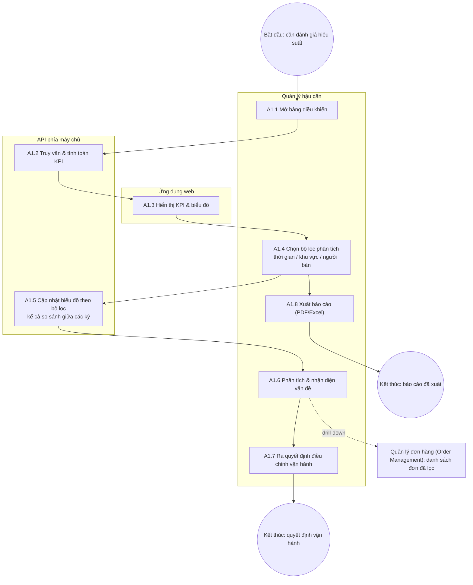
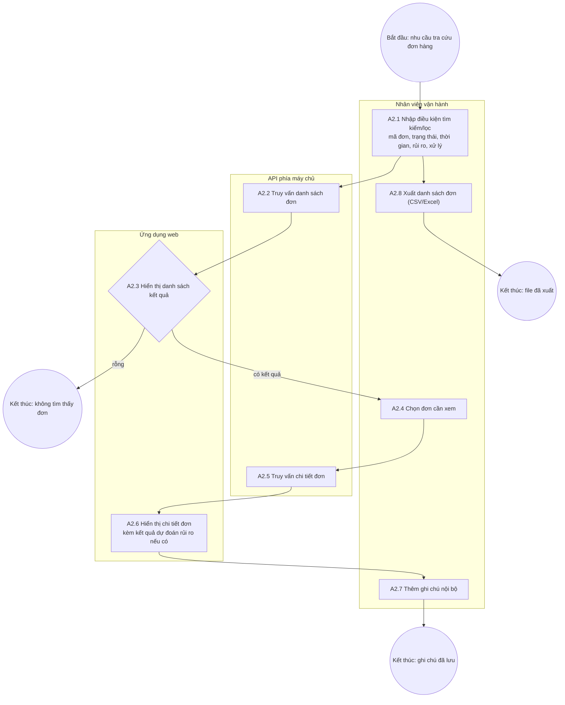
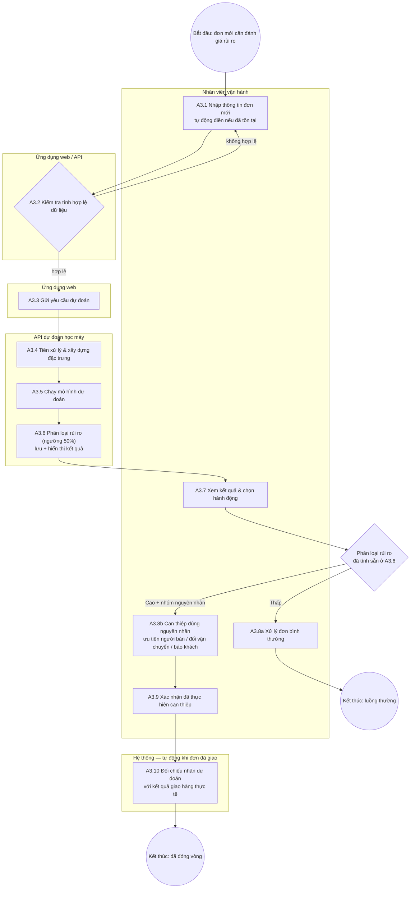

# Phân tích quy trình nghiệp vụ — Ship Guard

Áp dụng khung phân loại quy trình BPM (Business Process Management) vào phạm vi dự án, để làm rõ Ship Guard đang phục vụ/thay thế quy trình vận hành nào — không chỉ là danh sách tính năng.

## 0. Khung phân loại

Theo mô hình Chuỗi giá trị (Value Chain), quy trình nghiệp vụ chia làm 3 nhóm:

| Nhóm | Bản chất | Khách hàng phục vụ |
| --- | --- | --- |
| **Cốt lõi (Core)** | Tạo ra và giao giá trị trực tiếp | Khách hàng bên ngoài — cảm nhận ngay nếu quy trình gặp sự cố |
| **Hỗ trợ (Support)** | Cung cấp nguồn lực để quy trình cốt lõi vận hành trơn tru | Nội bộ — khách hàng ngoài không thấy |
| **Quản lý (Management)** | Đo lường, giám sát, định hướng | Ban lãnh đạo/quản lý |

Một chuỗi công việc chỉ tính là "quy trình nghiệp vụ" khi có đủ: sự kiện kích hoạt (trigger), input/output tạo giá trị, các bước tuần tự kèm điểm quyết định, và actor/tài nguyên thực thi rõ ràng.

## 1. Tổng quan nghiệp vụ

Ứng dụng phục vụ nghiệp vụ **giám sát và quản lý rủi ro giao hàng** trong hậu cần. Người dùng là **nhân viên vận hành** và **quản lý hậu cần**. Có 3 nghiệp vụ chính:

1. **Giám sát hiệu suất giao hàng** — theo dõi KPI để đánh giá chất lượng vận hành.
2. **Tra cứu và quản lý đơn hàng** — tìm kiếm, xem trạng thái đơn.
3. **Đánh giá rủi ro giao trễ** — dự đoán trước khi đơn được giao để can thiệp sớm (nghiệp vụ lõi).

Cả 3 quy trình vận hành trên nền vòng đời đơn hàng thực tế: khách đặt hàng → thanh toán được xác nhận → người bán chuẩn bị và đóng gói hàng → hàng được bàn giao cho đơn vị vận chuyển → đơn vị vận chuyển giao hàng đến khách → khách được mời đánh giá trải nghiệm. Một đơn được coi là **trễ** khi ngày giao hàng thực tế muộn hơn ngày giao hàng dự kiến đã cam kết với khách. So sánh này thực hiện ở mức **ngày lịch**: ngày dự kiến là một ngày cam kết chứ không phải một thời điểm cụ thể, nên đơn giao đúng ngày đã hứa được tính là **đúng hạn**, bất kể mấy giờ.

## 2. Quy trình 1: Giám sát hiệu suất (Performance Monitoring)

- **Tác nhân:** Quản lý hậu cần
- **Đầu vào:** Dữ liệu đơn hàng lịch sử, dữ liệu đánh giá của khách hàng
- **Đầu ra:** Báo cáo KPI, quyết định điều chỉnh vận hành

**Mô tả quy trình:** Quản lý đăng nhập và mở bảng điều khiển tổng quan → hệ thống truy vấn dữ liệu, tính toán và hiển thị bộ KPI gồm: tỷ lệ giao đúng hạn, số đơn trễ, **ba chặng thời gian tách riêng theo trách nhiệm** — thời gian chờ duyệt thanh toán (từ lúc đặt hàng đến lúc thanh toán được xác nhận), thời gian người bán chuẩn bị hàng (từ lúc thanh toán được xác nhận đến lúc bàn giao cho đơn vị vận chuyển), thời gian vận chuyển (từ lúc bàn giao đến lúc khách nhận hàng), mỗi chặng báo cáo bằng **trung vị kèm phân vị 90** chứ không phải trung bình cộng — **tỷ lệ đánh giá thấp có liên quan đến giao trễ** (trong các đơn bị khách chấm 1–2 sao, bao nhiêu phần trăm là đơn giao trễ), phân bố theo vùng (**bang của khách hàng nhận hàng**), xu hướng theo thời gian → quản lý chọn bộ lọc (khoảng thời gian, khu vực, **người bán**) để phân tích sâu → hệ thống cập nhật biểu đồ theo bộ lọc, **kể cả so sánh giữa các kỳ (kỳ này so với kỳ trước hoặc cùng kỳ năm trước) khi được chọn** → quản lý nhận diện vấn đề (ví dụ: vùng X có tỷ lệ trễ cao, hoặc thời gian xử lý của người bán kéo dài bất thường trong một giai đoạn) và ra quyết định điều chỉnh. Quản lý cũng có thể **xuất báo cáo (PDF/Excel)** từ trạng thái bảng điều khiển đã lọc, hoặc **nhảy sang [Quản lý đơn hàng (Order Management)](#3-quy-trình-2-quản-lý-đơn-hàng-order-management)** (danh sách đơn đã lọc sẵn) khi click vào một điểm bất thường trên biểu đồ. Hai hoạt động này — A1.6 (drill-down) và A1.8 (xuất báo cáo) — **chưa được triển khai** trong bản đầu tiên; chúng vẫn thuộc quy trình nghiệp vụ nhưng nằm ngoài phạm vi bản đang xây.

Việc tách vòng đời đơn thành ba chặng giúp quản lý xác định chính xác điểm nghẽn thuộc về ai: cổng thanh toán và ngân hàng, người bán, hay đơn vị vận chuyển. Nếu gộp thời gian chờ duyệt thanh toán vào thời gian của người bán, một đơn chậm vì ngân hàng sẽ bị quy oan cho người bán. Việc dùng trung vị kèm phân vị 90 thay cho trung bình cộng là vì cả ba chặng đều lệch đuôi mạnh — một nhúm đơn cá biệt kéo trung bình lệch xa giá trị điển hình. Việc đưa thêm tỷ lệ đánh giá thấp liên quan đến trễ vào bộ KPI giúp gắn hiệu suất vận hành nội bộ với trải nghiệm thực tế của khách hàng. Bộ lọc theo người bán, so sánh giữa các kỳ, xuất báo cáo và drill-down sang [Quản lý đơn hàng (Order Management)](#3-quy-trình-2-quản-lý-đơn-hàng-order-management) là các mở rộng giúp quản lý đi từ nhìn thấy vấn đề đến hành động nhanh hơn, tận dụng dữ liệu KPI đã có sẵn.

| # | Hoạt động | Tài nguyên thực hiện | Đầu vào | Đầu ra |
| --- | --- | --- | --- | --- |
| A1.1 | Mở bảng điều khiển | Quản lý hậu cần | — | Yêu cầu xem bảng điều khiển |
| A1.2 | Truy vấn & tính toán KPI (gồm ba chặng thời gian, mỗi chặng lấy trung vị và phân vị 90) | API phía máy chủ | Dữ liệu đơn hàng lịch sử, dữ liệu đánh giá khách hàng | Bộ chỉ số KPI |
| A1.3 | Hiển thị KPI & biểu đồ | Ứng dụng web | Bộ chỉ số KPI | Bảng điều khiển trực quan |
| A1.4 | Chọn bộ lọc phân tích (thời gian — theo ngày giao thực tế, khu vực — bang của khách hàng, người bán) | Quản lý hậu cần | Bảng điều khiển | Điều kiện lọc |
| A1.5 | Cập nhật biểu đồ theo bộ lọc (kể cả so sánh giữa các kỳ) | API + Ứng dụng web | Điều kiện lọc | Biểu đồ đã lọc |
| A1.6 | Phân tích & nhận diện vấn đề | Quản lý hậu cần | Biểu đồ đã lọc | Nhận định vấn đề; hoặc điều hướng sang [Quản lý đơn hàng (Order Management)](#3-quy-trình-2-quản-lý-đơn-hàng-order-management) với bộ lọc tương ứng — _phần điều hướng chưa triển khai_ |
| A1.7 | Ra quyết định điều chỉnh vận hành | Quản lý hậu cần | Nhận định vấn đề | Quyết định điều chỉnh |
| A1.8 | Xuất báo cáo — _chưa triển khai_ | Quản lý hậu cần | Bảng điều khiển đã lọc | File báo cáo (PDF/Excel) |

**Sự kiện:** bắt đầu — quản lý cần đánh giá hiệu suất (theo nhu cầu hoặc định kỳ); trung gian — dữ liệu KPI được trả về từ API; kết thúc — quyết định vận hành được đưa ra, hoặc báo cáo được xuất ra.

**Đối tượng nghiệp vụ:** Báo cáo hiệu suất (được tạo → được phân tích → dẫn đến quyết định); Dữ liệu đơn hàng lịch sử và dữ liệu đánh giá khách hàng (kho dữ liệu); Bộ chỉ số KPI (tỷ lệ đúng hạn, số đơn trễ, ba chặng thời gian — chờ duyệt thanh toán, người bán chuẩn bị hàng, vận chuyển — mỗi chặng có trung vị và phân vị 90, tỷ lệ đánh giá thấp do trễ, phân bố theo bang khách hàng, xu hướng); Điều kiện lọc; File báo cáo (PDF/Excel).

**Định hướng mở rộng:**

- **Dự báo xu hướng khối lượng đơn theo mùa vụ** (cảnh báo trước cao điểm tháng 10–11) — cần một mô hình dự báo riêng, hiện chưa có mô tả kỹ thuật nào cho việc này.
- **Đóng vòng đánh giá can thiệp vận hành** (ghi nhận quyết định A1.7 + so sánh KPI trước/sau, cảnh báo chủ động theo ngưỡng KPI) — nối tiếp cơ chế đóng vòng đã thiết kế ở Quy trình 3 (mục 4, A3.9–A3.10), nhưng chỉ nên triển khai sau khi có kinh nghiệm thực tế từ [Dự đoán rủi ro giao trễ (Risk Prediction)](#4-quy-trình-3-dự-đoán-rủi-ro-giao-trễ-risk-prediction): quy kết một biến động KPI tổng thể cho một quyết định vận hành đơn lẻ khó hơn nhiều so với đối chiếu một nhãn dự đoán với một đơn hàng cụ thể (nhiễu bởi nhiều yếu tố cùng lúc), và ngưỡng cảnh báo KPI hợp lý chưa có cơ sở dữ liệu để xác định.

## 3. Quy trình 2: Quản lý đơn hàng (Order Management)

- **Tác nhân:** Nhân viên vận hành
- **Đầu vào:** Yêu cầu tra cứu (mã đơn, trạng thái, khoảng thời gian, mức rủi ro, trạng thái xử lý)
- **Đầu ra:** Thông tin chi tiết đơn hàng

**Phạm vi:** quy trình này hiện chỉ gồm các hoạt động **tra cứu và hiển thị** — không có hành động ghi/thay đổi trạng thái đơn ở đây. Trạng thái "đã xử lý/chưa xử lý" của can thiệp rủi ro được ghi nhận trong dữ liệu của [Dự đoán rủi ro giao trễ (Risk Prediction)](#4-quy-trình-3-dự-đoán-rủi-ro-giao-trễ-risk-prediction) (A3.6, A3.9), không bắt buộc phải đi qua giao diện.

**Mô tả quy trình:** Nhân viên mở trang quản lý đơn, nhập điều kiện tìm kiếm/lọc (kể cả lọc theo mức rủi ro và trạng thái xử lý, lấy từ dữ liệu [Dự đoán rủi ro giao trễ (Risk Prediction)](#4-quy-trình-3-dự-đoán-rủi-ro-giao-trễ-risk-prediction)) → hệ thống truy vấn và trả về danh sách đơn phù hợp, hoặc **thông báo "không tìm thấy đơn" nếu danh sách rỗng** → nhân viên chọn một đơn để xem chi tiết → hệ thống hiển thị thông tin sản phẩm, người bán, địa chỉ giao, ngày dự kiến/thực tế, trạng thái đúng hạn/trễ, và **kết quả dự đoán rủi ro nếu đơn đã được đánh giá qua [Dự đoán rủi ro giao trễ (Risk Prediction)](#4-quy-trình-3-dự-đoán-rủi-ro-giao-trễ-risk-prediction)** → nhân viên có thể **thêm ghi chú nội bộ** vào đơn, hoặc **xuất danh sách đơn đã lọc ra file**.

| # | Hoạt động | Tài nguyên thực hiện | Đầu vào | Đầu ra |
| --- | --- | --- | --- | --- |
| A2.1 | Nhập điều kiện tìm kiếm/lọc (mã đơn, trạng thái, thời gian, mức rủi ro, trạng thái xử lý) | Nhân viên vận hành | Nhu cầu tra cứu | Điều kiện truy vấn |
| A2.2 | Truy vấn danh sách đơn | API phía máy chủ | Điều kiện truy vấn | Danh sách đơn phù hợp (có thể rỗng) |
| A2.3 | Hiển thị danh sách kết quả, hoặc thông báo không tìm thấy đơn | Ứng dụng web | Danh sách đơn | Bảng đơn hàng trên giao diện, hoặc thông báo rỗng |
| A2.4 | Chọn đơn cần xem | Nhân viên vận hành | Bảng đơn hàng | Mã đơn được chọn |
| A2.5 | Truy vấn chi tiết đơn | API phía máy chủ | Mã đơn | Dữ liệu chi tiết đơn |
| A2.6 | Hiển thị chi tiết đơn (kèm kết quả dự đoán rủi ro nếu có) | Ứng dụng web | Dữ liệu chi tiết, kết quả dự đoán (nếu có) | Trang chi tiết đơn |
| A2.7 | Thêm ghi chú nội bộ | Nhân viên vận hành | Trang chi tiết đơn, nội dung ghi chú | Ghi chú được lưu vào đơn |
| A2.8 | Xuất danh sách đơn ra file | Nhân viên vận hành | Danh sách đơn đã lọc | File xuất (CSV/Excel) |

**Sự kiện:** bắt đầu — phát sinh nhu cầu tra cứu đơn hàng; trung gian — kết quả truy vấn được trả về (có thể rỗng); kết thúc — nhân viên nhận được thông tin đơn cần tìm, hoặc đã xuất file.

**Đối tượng nghiệp vụ:** Đơn hàng (được tra cứu → được xem chi tiết); Điều kiện tìm kiếm; Danh sách đơn; Chi tiết đơn (sản phẩm, người bán, địa chỉ, ngày dự kiến/thực tế, trạng thái, kết quả dự đoán rủi ro nếu có); Ghi chú nội bộ; File xuất danh sách đơn.

**Định hướng mở rộng:**

- **Lịch sử thay đổi trạng thái đơn (audit trail)** — cần một mô hình dữ liệu log riêng (ai đổi gì, khi nào) chưa được thiết kế.
- **Nhắc việc tự động khi có đơn rủi ro cao chưa xử lý sau một khoảng thời gian** — nối tiếp trạng thái "đã xử lý/chưa xử lý" đã có (A3.6, A3.9), nhưng thiếu một tham số cụ thể: khoảng thời gian bao lâu thì nhắc, hiện chưa có cơ sở nào để quyết định con số này.

## 4. Quy trình 3: Dự đoán rủi ro giao trễ (Risk Prediction)

- **Tác nhân:** Nhân viên vận hành
- **Đầu vào:** Thông tin đơn hàng mới (cân nặng, danh mục, hình thức thanh toán, cặp vùng người bán–người mua, thời điểm đặt hàng...)
- **Đầu ra:** Kết quả phân loại đúng hạn/trễ + xác suất + nhóm nguyên nhân rủi ro chính (chuẩn bị hàng chậm hay vận chuyển chậm) + phân loại mức rủi ro cao/thấp

**Mô tả quy trình:** Nhân viên nhập thông tin đơn mới vào biểu mẫu dự đoán — **hệ thống tự động điền sẵn các trường đã biết nếu đơn đã tồn tại trong hệ thống**, nhân viên chỉ cần xác nhận/bổ sung — bao gồm cả **hình thức thanh toán** (thanh toán qua thẻ tín dụng có thể phải chờ ngân hàng xác nhận trước khi đơn được xử lý, nên cũng là một yếu tố rủi ro), **cặp vùng gửi–nhận cụ thể** (không chỉ khoảng cách đường chim bay — thực tế cho thấy tuyến từ Paraná đến Distrito Federal giao dưới 10 ngày, trong khi tuyến từ Minas Gerais đến Rio Grande do Sul hoặc đến Paraná có thể mất hơn 40 ngày, và các bang Roraima/Amapá có độ trễ trung bình cao nhất) và **thời điểm đặt hàng** (để nhận diện các mùa cao điểm như tháng 10–11, khi khối lượng đơn tăng đột biến và gây áp lực lên chuỗi cung ứng) → hệ thống kiểm tra tính hợp lệ dữ liệu đầu vào → giao diện gửi yêu cầu đến REST API → API tiền xử lý dữ liệu và xây dựng đặc trưng (bao gồm cặp vùng gửi–nhận, hình thức thanh toán, mùa vụ), đưa vào mô hình học máy → mô hình trả về kết quả đúng hạn/trễ kèm xác suất và nhóm nguyên nhân rủi ro chính → **hệ thống tự động phân loại mức rủi ro cao/thấp theo ngưỡng cố định (xác suất trễ > 50% = rủi ro cao), lưu toàn bộ kết quả (nhãn, xác suất, phân loại, thời điểm) vào bản ghi đơn hàng kèm trường trạng thái "chưa xử lý", rồi hiển thị kết quả** → nhân viên xem kết quả đã phân loại sẵn và chọn hành động: rủi ro thấp → xử lý đơn bình thường; rủi ro cao → can thiệp **đúng theo nguyên nhân** (nhắc/ưu tiên người bán nếu rủi ro ở khâu chuẩn bị hàng, đổi đơn vị vận chuyển nếu rủi ro ở khâu giao hàng, hoặc chủ động thông báo khách hàng), sau đó **đánh dấu đơn là "đã xử lý"** → khi đơn thực sự được giao (chuyển trạng thái "đã giao" theo vòng đời đơn hàng), **hệ thống tự động đối chiếu nhãn dự đoán ban đầu với kết quả giao hàng thực tế**, khép lại vòng đánh giá.

> **Quyết định:** việc phân loại mức rủi ro cao/thấp là **hệ thống tự động thực hiện theo ngưỡng cố định**, khác với thiết kế ban đầu vốn giao việc đánh giá này cho nhân viên vận hành. Ngưỡng 50% là giá trị khởi điểm cho MVP, không phải con số cuối cùng — cần xem lại sau khi có kết quả đánh giá mô hình (precision/recall).
>
> **Quyết định:** kết quả dự đoán được lưu lại gắn với đơn hàng (không phải phép tính thử-rồi-quên), kèm sẵn trường trạng thái "đã xử lý/chưa xử lý" — đây là điều kiện cần để đóng vòng đánh giá can thiệp rủi ro (A3.9, A3.10) hoạt động được.

Việc phân tách nguyên nhân rủi ro (người bán hay vận chuyển) là cải tiến quan trọng so với việc chỉ dự đoán một nhãn "trễ" chung — nếu không phân tách, nhân viên vận hành có thể chọn sai biện pháp can thiệp (ví dụ đổi đơn vị vận chuyển trong khi lỗi thực chất nằm ở người bán chuẩn bị hàng chậm).

| # | Hoạt động | Tài nguyên thực hiện | Đầu vào | Đầu ra |
| --- | --- | --- | --- | --- |
| A3.1 | Nhập thông tin đơn mới (tự động điền nếu đơn đã tồn tại) | Nhân viên vận hành | Thông tin đơn thực tế (cân nặng, danh mục, hình thức thanh toán, cặp vùng gửi–nhận, thời điểm đặt hàng) | Bộ tham số đầu vào |
| A3.2 | Kiểm tra tính hợp lệ dữ liệu | Ứng dụng web / API | Bộ tham số đầu vào | Dữ liệu hợp lệ (hoặc báo lỗi) |
| A3.3 | Gửi yêu cầu dự đoán | Ứng dụng web | Dữ liệu hợp lệ | Yêu cầu đến API |
| A3.4 | Tiền xử lý & xây dựng đặc trưng | API dự đoán học máy | Yêu cầu | Vec-tơ đặc trưng (gồm cặp vùng gửi–nhận, hình thức thanh toán, mùa vụ) |
| A3.5 | Chạy mô hình dự đoán | API dự đoán học máy | Vec-tơ đặc trưng | Nhãn + xác suất + nhóm nguyên nhân rủi ro chính |
| A3.6 | Phân loại mức rủi ro (ngưỡng 50%), lưu và hiển thị kết quả | API dự đoán học máy + Ứng dụng web | Nhãn + xác suất + nhóm nguyên nhân | Kết quả rủi ro đã phân loại, hiển thị trên giao diện + lưu vào bản ghi đơn (trạng thái "chưa xử lý") |
| A3.7 | Xem kết quả & chọn hành động | Nhân viên vận hành | Kết quả rủi ro trên giao diện | Quyết định hành động |
| A3.8a | Xử lý đơn bình thường | Nhân viên vận hành | Quyết định (rủi ro thấp) | Đơn vào luồng thường |
| A3.8b | Thực hiện biện pháp can thiệp đúng nguyên nhân | Nhân viên vận hành | Quyết định (rủi ro cao) kèm nhóm nguyên nhân | Đơn được ưu tiên xử lý / đổi vận chuyển / thông báo khách |
| A3.9 | Xác nhận đã thực hiện can thiệp | Nhân viên vận hành | Đơn đã can thiệp (A3.8b) | Trạng thái đơn → "đã xử lý" |
| A3.10 | Đối chiếu nhãn dự đoán với kết quả giao hàng thực tế | Hệ thống (tự động, khi đơn chuyển trạng thái "đã giao") | Nhãn dự đoán đã lưu (A3.6), ngày giao thực tế | Kết quả đối chiếu (dự đoán đúng/sai) gắn vào bản ghi đơn |

Giữa A3.7 và A3.8a/A3.8b có **cổng rẽ nhánh loại trừ (exclusive gateway — XOR)**, quyết định bởi phân loại mức rủi ro đã tính sẵn ở A3.6 (không còn là đánh giá chủ quan của nhân viên).

**Sự kiện:** bắt đầu — đơn hàng mới cần đánh giá rủi ro; trung gian — nhận kết quả từ API học máy, hoặc dữ liệu không hợp lệ (quay lại nhập), hoặc đơn chuyển trạng thái "đã giao"; kết thúc 1 — đơn được xử lý theo luồng bình thường; kết thúc 2 — đã thực hiện can thiệp và đánh dấu "đã xử lý"; kết thúc 3 — đã đối chiếu dự đoán với kết quả giao hàng thực tế (đóng vòng).

**Đối tượng nghiệp vụ:** Đơn hàng (mới → đã đánh giá rủi ro → đã xử lý thường/can thiệp → đã đối chiếu); Bộ tham số đầu vào (cân nặng, danh mục, hình thức thanh toán, cặp vùng gửi–nhận, thời điểm đặt hàng); Vec-tơ đặc trưng; Kết quả dự đoán (nhãn đúng hạn/trễ + xác suất + nhóm nguyên nhân rủi ro + phân loại cao/thấp); Trạng thái xử lý ("đã xử lý"/"chưa xử lý"); Kết quả đối chiếu dự đoán vs thực tế; Mô hình học máy (tệp đã huấn luyện, được API nạp).

**Giá trị nghiệp vụ** nằm ở bước A3.7→A3.8: dự đoán chỉ có ý nghĩa khi dẫn đến hành động can thiệp sớm và đúng nguyên nhân, biến quy trình từ **phản ứng** (khách phàn nàn mới biết trễ) sang **chủ động** (biết trước rủi ro để xử lý). Bước A3.9→A3.10 khép vòng đánh giá này lại: xác nhận can thiệp đã thực sự diễn ra, và đối chiếu dự đoán với kết quả thật để biết mô hình và biện pháp can thiệp có hiệu quả hay không.

**Định hướng mở rộng:**

- **Huấn luyện lại mô hình định kỳ khi có thêm dữ liệu giao hàng thực tế** — thuộc vận hành hệ thống/MLOps, không có actor nghiệp vụ tương tác qua giao diện, nên không đưa vào bảng hoạt động này.
- **Theo dõi model drift** (cảnh báo khi độ chính xác mô hình giảm dần) — phụ thuộc trực tiếp vào A3.10 (cần đủ dữ liệu đối chiếu trước mới tính được độ chính xác theo thời gian); chưa có ngưỡng cảnh báo cụ thể.
- **Dự đoán hàng loạt (batch) cho nhiều đơn cùng lúc** — thay đổi cơ chế nhập liệu (upload file thay vì nhập form), nhưng định dạng file, giới hạn số lượng đơn mỗi lần chưa được xác định.
- **Giải thích dự đoán (explainability)** — hiển thị yếu tố đóng góp nhiều nhất vào rủi ro của một đơn cụ thể, mở rộng tự nhiên từ A3.6; cơ chế tính toán cụ thể (phương pháp explainability nào) chưa được xác định.

## 5. Giới hạn được chấp nhận

- **Tần suất giám sát** chưa được định nghĩa thành chu kỳ cố định — chấp nhận: quản lý mở bảng điều khiển hoàn toàn theo nhu cầu, không có lịch cố định.
- **Phân quyền dữ liệu theo vùng** chưa cần thiết khi hệ thống chỉ có một quản lý sử dụng — cần xem lại khi có nhiều người dùng quản lý hơn.

## 6. Định hướng mở rộng ngoài phạm vi

Ngoài các quy trình trên, dự án đã tự nêu 3 hướng mở rộng dài hạn, chưa phân rã thành quy trình cụ thể — chỉ ghi nhận làm điểm tham chiếu:

- **Tối ưu tuyến đường** vận chuyển.
- **Trợ lý AI hỏi đáp** trên dữ liệu vận hành.
- **Hệ thống quản lý chuỗi cung ứng đầy đủ hơn** (kho, tồn).
