# ShipGuard: Delivery Performance Intelligence

## Tài liệu hướng dẫn cài đặt và sử dụng

- Sinh viên thực hiện: Nguyễn Thanh Thịnh, MSSV 22730096 (đồ án cá nhân)
- Giảng viên hướng dẫn: ThS. Mai Xuân Hùng
- Tháng 9 năm 2026

---

## 1. Giới thiệu

ShipGuard là một ứng dụng web giúp doanh nghiệp giao vận theo dõi hiệu suất giao hàng và biết trước đơn nào có nguy cơ giao trễ. Ứng dụng dùng dữ liệu đơn hàng thương mại điện tử Olist của Brazil (99.441 đơn, giai đoạn 2016–2018). Khi có một đơn mới, ShipGuard ước lượng xác suất giao trễ và xếp đơn đó vào mức "Rủi ro cao" hoặc "Rủi ro thấp" để nhân viên vận hành xử lý sớm.

Tài liệu này hướng dẫn hai việc: cài đặt và chạy ứng dụng chỉ bằng một lệnh, và dùng các chức năng chính. Người đọc không cần biết lập trình.

Bài nộp gồm bốn thư mục. Thư mục Docs chứa báo cáo, bài thuyết trình và tài liệu này. Thư mục Source chứa mã nguồn, cấu hình, mô hình dự đoán đã huấn luyện và bản dữ liệu nạp sẵn. Thư mục Data chứa tệp `shipguard.sql`, bản sao lưu toàn bộ cơ sở dữ liệu. Thư mục Demo chứa video giới thiệu chương trình.

## 2. Cài đặt và khởi động

### 2.1 Chuẩn bị (làm một lần)

Máy cần cài Docker: Docker Desktop trên Windows 10/11 hoặc macOS, hoặc Docker Engine kèm Docker Compose trên Linux. Khi cài Docker Desktop trên Windows, để nguyên các tùy chọn mặc định. Không cần cài Python, Node.js hay PostgreSQL.

Lần chạy đầu cần có Internet để Docker tải các thành phần cần thiết, ổ đĩa còn trống khoảng 8 GB và nên có RAM 8 GB. Ba cổng 3000 (giao diện), 8000 (máy chủ xử lý) và 5432 (cơ sở dữ liệu) phải còn trống. Nếu máy đang chạy một PostgreSQL riêng, hãy tắt nó trước vì nó chiếm cổng 5432.

### 2.2 Các bước

1. Mở Docker Desktop và chờ đến khi nó báo "Engine running".
2. Giải nén tệp ZIP, mở thư mục vừa giải nén.
3. Mở Terminal ngay tại thư mục `Source`.
4. Chạy lệnh sau:

   ```
   docker compose up -d --build --wait
   ```

5. Lần đầu, Docker phải tải và dựng các thành phần nên có thể mất từ vài phút đến khoảng 15 phút tùy tốc độ mạng. Lệnh xong khi các dòng `Container ... Healthy` hiện ra và dấu nhắc trở lại mà không có thông báo lỗi.
6. Mở trình duyệt và vào http://localhost:3000. Trang đăng nhập hiện ra là thành công.

### 2.3 Lệnh trên đã làm gì

Lệnh dựng và khởi động ba dịch vụ chạy cùng nhau. Dịch vụ `postgres` là cơ sở dữ liệu PostgreSQL, ở lần đầu tự nạp sẵn 99.441 đơn hàng và ba tài khoản thử, dùng cổng 5432. Dịch vụ `backend` là máy chủ xử lý, gồm cả mô hình dự đoán rủi ro, dùng cổng 8000. Dịch vụ `frontend` là giao diện người dùng, dùng cổng 3000. Các lần chạy sau nhanh hơn nhiều, chỉ mất vài chục giây vì mọi thứ đã có sẵn.

### 2.4 Dừng, chạy lại, đặt lại và gỡ bỏ

Các lệnh dưới đây đều chạy trong thư mục `Source`. Để tạm dừng mà giữ nguyên dữ liệu:

```
docker compose stop
```

Để chạy lại sau khi tạm dừng:

```
docker compose up -d
```

Để đưa dữ liệu về như ban đầu, xóa mọi thao tác đã làm, chạy lệnh dưới rồi chạy lại lệnh ở bước 4 mục 2.2:

```
docker compose down -v
```

Để gỡ hoàn toàn và giải phóng ổ đĩa:

```
docker compose down -v --rmi local
```

### 2.5 Gặp sự cố

Các sự cố thường gặp và cách xử lý được nêu ở Bảng 2.1.

Bảng 2.1. Các sự cố thường gặp khi cài đặt

| Dấu hiệu | Nguyên nhân | Cách xử lý |
| --- | --- | --- |
| "Cannot connect to the Docker daemon" | Docker Desktop chưa chạy | Mở Docker Desktop, chờ báo "Engine running" rồi chạy lại lệnh |
| "port is already allocated" hoặc "address already in use" (cổng 3000, 8000 hoặc 5432) | Có chương trình khác đang dùng cổng đó, thường là một PostgreSQL cài sẵn trên máy | Tắt chương trình đó rồi chạy lại lệnh. Không đổi số cổng |
| Lệnh báo lỗi khi đang tải hoặc dựng (lỗi mạng, hết thời gian chờ) | Mất kết nối Internet | Kiểm tra mạng rồi chạy lại đúng lệnh cũ, Docker sẽ làm tiếp từ chỗ dở |
| Mở được trang nhưng không có dữ liệu | Lần nạp dữ liệu đầu tiên bị gián đoạn | Chạy `docker compose down -v` rồi chạy lại `docker compose up -d --build --wait` |
| Trang đăng nhập báo "Không kết nối được máy chủ. Vui lòng thử lại." | Máy chủ xử lý chưa sẵn sàng | Chờ khoảng 30 giây rồi thử lại. Xem tình trạng bằng `docker compose ps`, xem nhật ký bằng `docker compose logs backend` |
| Tạo đơn báo "Mô hình dự đoán rủi ro chưa sẵn sàng. Vui lòng thử lại sau." | Thiếu thư mục `models` nằm cạnh `docker-compose.yml` | Chép lại thư mục `models` từ gói nộp vào thư mục `Source`, rồi thử tạo đơn lại. Nếu vẫn báo lỗi, chạy `docker compose restart backend` |
| Quên mật khẩu Super Admin | Không còn nhớ mật khẩu đã đặt | Chạy lệnh đặt lại mật khẩu ở dưới bảng |

Để đặt lại mật khẩu Super Admin, chạy lệnh sau và nhập mật khẩu mới hai lần theo yêu cầu (tối thiểu 8 ký tự, không hiện ra khi gõ):

```
docker compose exec backend uv run --no-sync python -m app.scripts.reset_super_admin_password
```

Đặt xong, mật khẩu cũ không dùng được nữa và mọi phiên đăng nhập của tài khoản này bị đăng xuất.

## 3. Đăng nhập và phân quyền

ShipGuard có sẵn ba tài khoản thử, dùng chung mật khẩu `ShipGuard@2026` (Bảng 3.1).

Bảng 3.1. Các tài khoản thử

| Vai trò | Email | Dùng để |
| --- | --- | --- |
| Super Admin | `admin@shipguard.local` | Xem mọi chức năng và quản trị toàn bộ tài khoản |
| Quản lý hậu cần | `logistics_manager@shipguard.com` | Mọi việc của nhân viên vận hành, cộng thêm quản lý tài khoản của nhân viên vận hành |
| Nhân viên vận hành | `operations_staff@shipguard.com` | Theo dõi đơn, tạo đơn, ghi nhận xử lý, ghi chú |

Trên thanh bên, tên hiển thị của ba tài khoản thử là tiếng Anh ("Super Admin", "Logistics Manager", "Operations Staff"), còn dòng vai trò bên dưới hiện bằng tiếng Việt. Việc mỗi vai trò làm được nêu ở Bảng 3.2.

Bảng 3.2. Chức năng theo vai trò

| Chức năng | Nhân viên vận hành | Quản lý hậu cần | Super Admin |
| --- | --- | --- | --- |
| Bảng điều khiển, Quản lý đơn hàng, xuất CSV | Có | Có | Có |
| Tạo đơn, ghi nhận mốc, hủy đơn, ghi nhận xử lý, ghi chú nội bộ | Có | Có | Có |
| Chỉ số mô hình | Có | Có | Có |
| Quản trị (quản lý tài khoản) | Không | Có | Có |
| Tạo tài khoản Quản lý hậu cần, đổi vai trò | Không | Không | Có |

Để thấy sự khác biệt, đăng nhập lần lượt từng vai trò và nhìn thanh bên trái: Nhân viên vận hành chỉ có ba mục (Bảng điều khiển, Quản lý đơn hàng, Chỉ số mô hình), hai vai trò còn lại có thêm mục Quản trị (Hình 3.1).

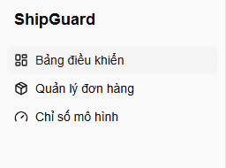

## 4. Hướng dẫn sử dụng

### 4.0 Tham quan nhanh giao diện

Nếu chỉ có ít thời gian, có thể làm theo chín bước dưới đây. Mỗi bước có mục hướng dẫn chi tiết ở phần sau.

1. Đăng nhập bằng Super Admin.
2. Xem Bảng điều khiển và thử các bộ lọc.
3. Mở Quản lý đơn hàng, thử tìm và lọc.
4. Tạo một đơn mới và xem Xác suất giao trễ.
5. Với đơn rủi ro cao, ghi nhận xử lý.
6. Ghi nhận một mốc vòng đời và thêm một ghi chú nội bộ.
7. Xem Chỉ số mô hình.
8. Vào Quản trị, tạo một tài khoản.
9. Đăng xuất, đăng nhập bằng vai trò khác để so sánh quyền.

### 4.1 Đăng nhập, đổi ngôn ngữ, đổi mật khẩu, đăng xuất

Vào http://localhost:3000, nhập email và mật khẩu rồi bấm "Đăng nhập" (Hình 4.1). Nếu nhập sai, trang chỉ báo chung một câu "Email hoặc mật khẩu không đúng." mà không nói sai ở đâu. Nút "English" ở góc trang đăng nhập chuyển giao diện sang tiếng Anh và ngược lại.

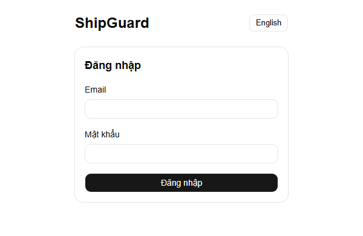

Sau khi đăng nhập, bấm vào tên tài khoản ở góc dưới thanh bên để mở menu gồm ba mục: "Đổi mật khẩu", chuyển ngôn ngữ và "Đăng xuất". Khi đổi mật khẩu, nhập mật khẩu hiện tại, mật khẩu mới (tối thiểu 8 ký tự) và nhập lại mật khẩu mới, rồi bấm "Lưu" (Hình 4.2). Các thiết bị khác đang đăng nhập bằng tài khoản này sẽ bị đăng xuất trong vòng 15 phút.

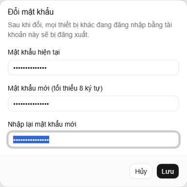

### 4.2 Bảng điều khiển

Đây là trang đầu tiên sau khi đăng nhập, cho biết tình hình giao hàng của một khoảng thời gian. Dữ liệu Olist là đơn hàng lịch sử, nên kỳ báo cáo mặc định là "01/09/2017 – 31/08/2018" và đã có sẵn số liệu, không cần chọn gì thêm. Muốn xem giai đoạn khác, dùng bộ lọc "Chọn khoảng thời gian".

Phần đầu trang có sáu thẻ số liệu. Thẻ "Tỷ lệ giao đúng hạn" cho biết tỷ lệ đơn giao đúng hạn (đơn giao đúng ngày đã cam kết được tính là đúng hạn) và số đơn đã giao; thẻ "Đơn giao trễ" cho biết số đơn trễ. Ba thẻ tiếp theo nói về thời gian từng chặng: duyệt thanh toán, người bán xử lý và vận chuyển. Mỗi thẻ có số ngày trung vị và "Phân vị 90", tức mức mà 90% đơn nhanh hơn. Thẻ "Đánh giá thấp do trễ" cho biết trong các đơn bị khách chấm 1–2 sao, có bao nhiêu phần trăm là đơn giao trễ.

Bốn bộ lọc ở đầu trang là khoảng thời gian, bang nhận hàng, người bán và chế độ so sánh ("Không so sánh", "Kỳ liền trước" hoặc "Cùng kỳ năm trước"). Người bán được chọn bằng cách gõ mã, bang hoặc thành phố rồi chọn trong danh sách gợi ý. Nút "Xoá hết bộ lọc" đưa mọi thứ về mặc định.

Bên dưới các thẻ là hai biểu đồ: "Xu hướng tỷ lệ trễ", xem được theo ngày, tuần hoặc tháng, và "Tỷ lệ trễ theo bang". Bấm vào một điểm trên đường xu hướng hoặc một cột theo bang sẽ mở danh sách các đơn trễ tương ứng. Khi bộ lọc chỉ còn rất ít đơn, trang hiện cảnh báo rằng các tỷ lệ phần trăm chưa đủ tin cậy. Hình 4.3 chỉ lấy phần đầu trang, đến hết biểu đồ xu hướng.

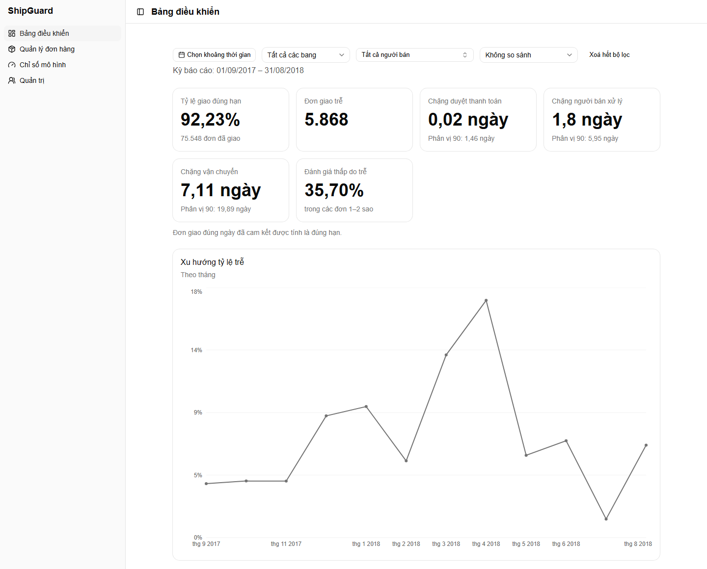

### 4.3 Quản lý đơn hàng

Trang này liệt kê tất cả đơn, đơn mới nhất ở trên (Hình 4.4). Đơn có sẵn từ dữ liệu Olist hiện "Chưa đánh giá" ở cột "Mức rủi ro". Đây là bình thường, vì ShipGuard chỉ đánh giá rủi ro cho đơn tạo trong ứng dụng.

Để tìm một đơn, gõ vài ký tự đầu của mã đơn vào ô tìm kiếm. Danh sách lọc được theo trạng thái đơn, kết quả giao, khoảng ngày đặt, khoảng ngày giao, bang, người bán, mức rủi ro và trạng thái xử lý ("Chưa xử lý" hoặc "Đã xử lý"); nút "Xoá hết bộ lọc" bỏ tất cả. Bấm vào tiêu đề các cột "Ngày đặt", "Ngày cam kết", "Ngày giao" hoặc "Giá trị" để sắp xếp, cuối danh sách có phân trang. Nút "Xuất CSV" tải về đúng danh sách đang lọc. Nút "Tạo đơn" mở màn hình tạo đơn (mục 4.4), còn bấm vào một dòng sẽ mở chi tiết đơn (mục 4.5).

Trong hình dưới, hai đơn ở đầu danh sách là hai đơn tạo trong ứng dụng ở mục 4.4, nên tổng số đơn tăng từ 99.441 lên 99.443. Các đơn còn lại là đơn Olist.

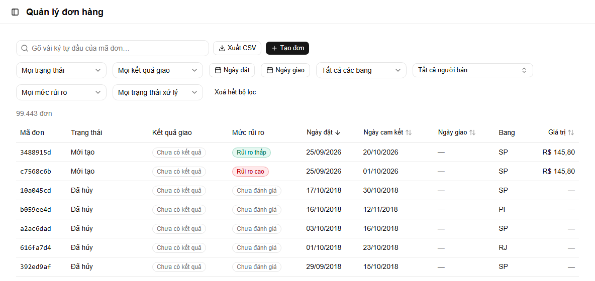

### 4.4 Tạo đơn mới và xem dự đoán rủi ro

Đây là chức năng chính của ShipGuard. Bấm "Tạo đơn" ở trang Quản lý đơn hàng, điền biểu mẫu theo Bảng 4.1 rồi bấm "Tạo đơn" ở cuối trang (Hình 4.5). Ô "Thời điểm đặt hàng" đã tự điền sẵn thời điểm hiện tại và ô "Ngày giao cam kết" là ngày hôm nay. Cách hiển thị ngày giờ trong hai ô này phụ thuộc cài đặt của trình duyệt, có thể là tháng/ngày/năm hoặc ngày/tháng/năm.

Bảng 4.1. Giá trị ví dụ khi tạo đơn

| Ô cần điền | Giá trị ví dụ |
| --- | --- |
| Thời điểm đặt hàng | Giữ nguyên (thời điểm hiện tại) |
| Ngày giao cam kết | Ví dụ A: 25 ngày sau hôm nay. Ví dụ B: 6 ngày sau hôm nay |
| Bang nhận hàng | SP |
| Thành phố | sao paulo |
| Mã bưu chính | 01310 |
| Người bán | Gõ `1f50f920`, chọn dòng "1f50f920… SP · sao jose do rio preto" |
| Danh mục | furniture_decor |
| Cân nặng (gram) | 500 |
| Giá | 120.5 |
| Phí vận chuyển | 25.3 |
| Thanh toán, Hình thức | Thẻ tín dụng |
| Thanh toán, Số tiền | 145.8 (bằng giá cộng phí vận chuyển) |
| Thanh toán, Số kỳ trả góp | 2 |

Hai ví dụ A và B chỉ khác nhau ở ngày giao cam kết. Ví dụ A hẹn giao trong 25 ngày, khá rộng rãi, nên đơn có nguy cơ trễ thấp. Ví dụ B hẹn giao trong 6 ngày, quá gấp so với thời gian người bán này thường cần, nên đơn có nguy cơ trễ cao.

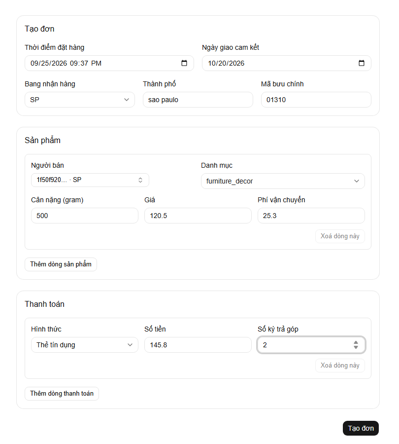

Tạo xong, ShipGuard chuyển sang trang chi tiết của đơn vừa tạo. Khối "Đánh giá rủi ro" hiện "Xác suất giao trễ" và nhãn "Rủi ro thấp" hoặc "Rủi ro cao"; đơn có xác suất từ 18% trở lên được xếp "Rủi ro cao". Xác suất được ước lượng bằng mô phỏng nên mỗi lần tạo có thể lệch nhẹ. Dòng "Điểm đánh giá" ghi "Vừa đặt hàng", nghĩa là đánh giá được làm ngay khi đơn được tạo. Riêng đơn rủi ro cao còn có thêm nguyên nhân dự kiến (chặng nào sẽ chậm, dự kiến mấy ngày so với thường lệ) và người bán liên quan.

Với hai ví dụ trên, ví dụ A cho xác suất giao trễ khoảng 4%, xếp "Rủi ro thấp" (Hình 4.6); ví dụ B cho khoảng 90%, xếp "Rủi ro cao", nguyên nhân dự kiến ở chặng người bán xử lý (Hình 4.7).

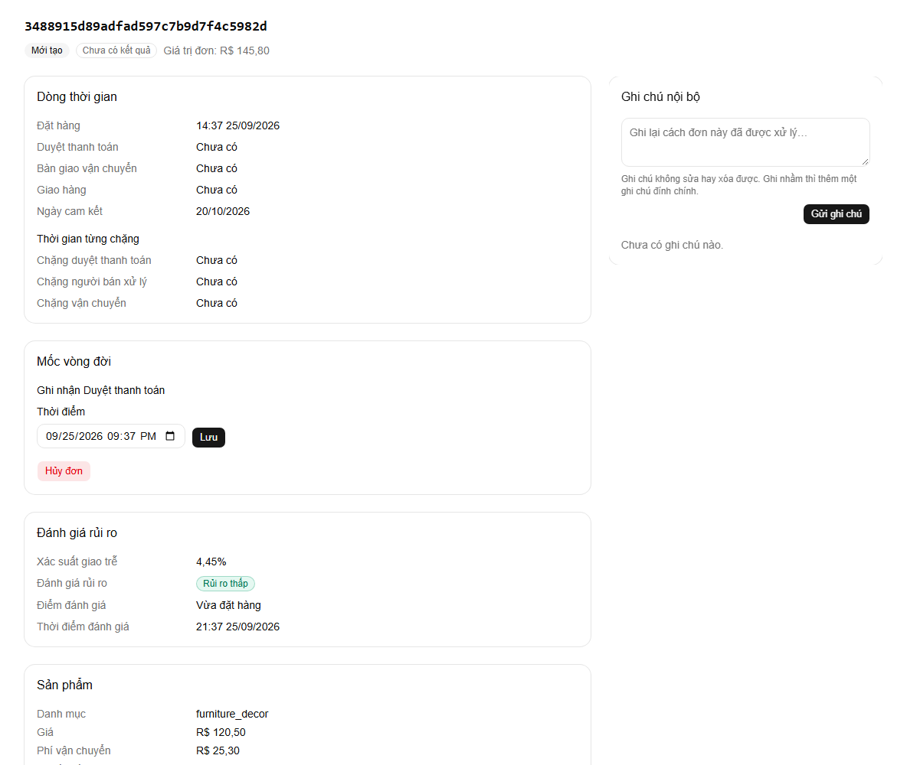

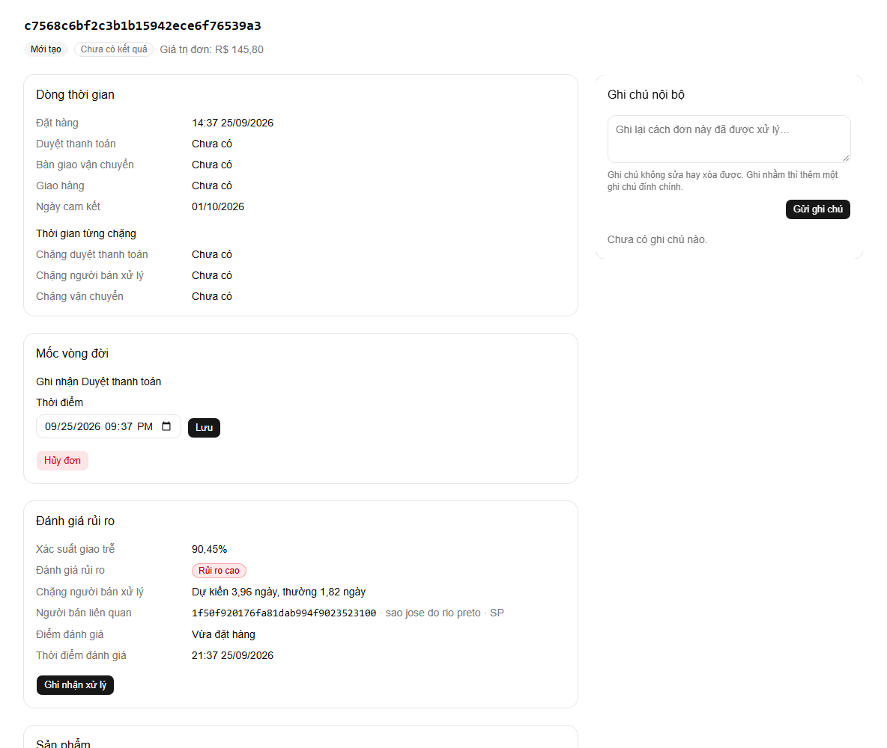

Nếu nhập sai, biểu mẫu báo ngay dưới ô tương ứng, ví dụ "Thời điểm đặt hàng không được ở trong tương lai.", "Ngày giao cam kết không được sớm hơn thời điểm đặt hàng." hoặc "Trường này không được để trống.".

### 4.5 Chi tiết đơn hàng

Bấm vào một đơn trong danh sách để xem chi tiết: trạng thái, kết quả giao và giá trị đơn, "Dòng thời gian" các mốc, "Thời gian từng chặng", đánh giá rủi ro, sản phẩm, người bán, địa chỉ giao, thanh toán và đánh giá của khách. Các mốc trong "Dòng thời gian" hiển thị theo giờ quốc tế UTC (giờ ghi trong dữ liệu), còn "Thời điểm đánh giá" hiển thị theo giờ của máy tính, nên ở Việt Nam hai giờ này lệch nhau 7 giờ. Đơn tạo trong ứng dụng có thêm các thao tác ở bốn mục dưới đây.

#### 4.5.1 Ghi nhận xử lý

Nút "Ghi nhận xử lý" chỉ hiện ở đơn rủi ro cao và ghi vào lần đánh giá mới nhất của đơn. Bấm nút này, chọn "Biện pháp" ("Nhắc hoặc ưu tiên người bán", "Đổi đơn vị vận chuyển", "Liên hệ về thanh toán", "Thông báo khách" hoặc "Khác"), viết thêm ghi chú nếu muốn rồi bấm "Lưu" (Hình 4.8). ShipGuard chỉ ghi lại việc đã làm, không tự nhắc người bán hay đổi đơn vị vận chuyển. Sau khi lưu, khối "Đánh giá rủi ro" hiện thêm biện pháp, ghi chú, người xử lý và thời điểm xử lý; ở danh sách đơn, đơn này thuộc nhóm "Đã xử lý".

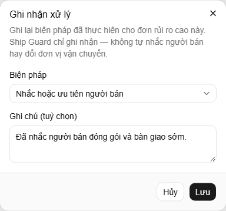

#### 4.5.2 Mốc vòng đời

Đơn đi qua ba mốc theo thứ tự: "Duyệt thanh toán", "Bàn giao vận chuyển" và "Khách nhận hàng". Ở khối "Mốc vòng đời", khung "Ghi nhận ..." luôn là mốc kế tiếp (Hình 4.9). Ô "Thời điểm" đã điền sẵn lúc này, chỉnh nếu cần rồi bấm "Lưu". Thời điểm không được ở tương lai và không được sớm hơn mốc liền trước. Mỗi mốc được ghi nhận sinh thêm một lần đánh giá rủi ro mới, các lần trước được xếp ở phần "Các lần đánh giá trước". Mốc vừa ghi có nút "Sửa" nếu cần chỉnh lại giờ.

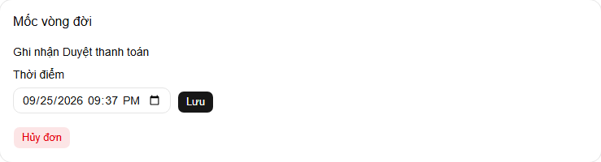

#### 4.5.3 Hủy đơn

Bấm "Hủy đơn", nút đỏ trong khối "Mốc vòng đời". Hộp thoại "Hủy đơn này?" cho hai lựa chọn: "Xác nhận hủy đơn", không hoàn tác được và đơn chuyển sang "Đã hủy", hoặc "Giữ đơn", đóng hộp thoại và đơn không đổi (Hình 4.10).


#### 4.5.4 Ghi chú nội bộ

Gõ nội dung vào khung "Ghi chú nội bộ" rồi bấm "Gửi ghi chú"; ghi chú hiện kèm tên người viết, vai trò và thời điểm (Hình 4.11). Ghi chú không sửa hay xóa được, ghi nhầm thì thêm một ghi chú đính chính.

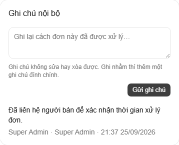

### 4.6 Chỉ số mô hình

Trang này cho biết mô hình dự đoán đang dùng đáng tin đến đâu. Phần đầu nêu phiên bản mô hình, thuật toán đang dùng, "Ngưỡng rủi ro cao đang áp dụng" (18%) và "F1 ở mốc đặt hàng" so với mục tiêu 30%. Bảng "So sánh thuật toán ứng viên" liệt kê các thuật toán đã thử, đo trên một tập kiểm tra cố định lúc huấn luyện. Bảng "Đối chiếu tích lũy trên đơn thật" so dự đoán với kết quả giao hàng thật: mỗi lần ghi nhận mốc "Khách nhận hàng" cho một đơn tạo trong ứng dụng, ShipGuard đối chiếu dự đoán với kết quả thật và cộng vào bảng này. Ở bản nộp, bảng này ban đầu trống vì chưa có đơn nào được đối chiếu.

F1 hiện "Chưa đạt" (19,72% so với mục tiêu 30%). Đây là kết quả thật của mô hình, đã được phân tích trong báo cáo (Chương 4), không phải lỗi cài đặt.

Hình 4.12 chụp sau khi đã ghi nhận "Khách nhận hàng" cho 10 đơn thử, nên bảng đối chiếu có số liệu (10 lần đối chiếu, 7 đúng, 3 sai). Vì mới có ít lần đối chiếu, trang cảnh báo chưa đủ để kết luận chắc.

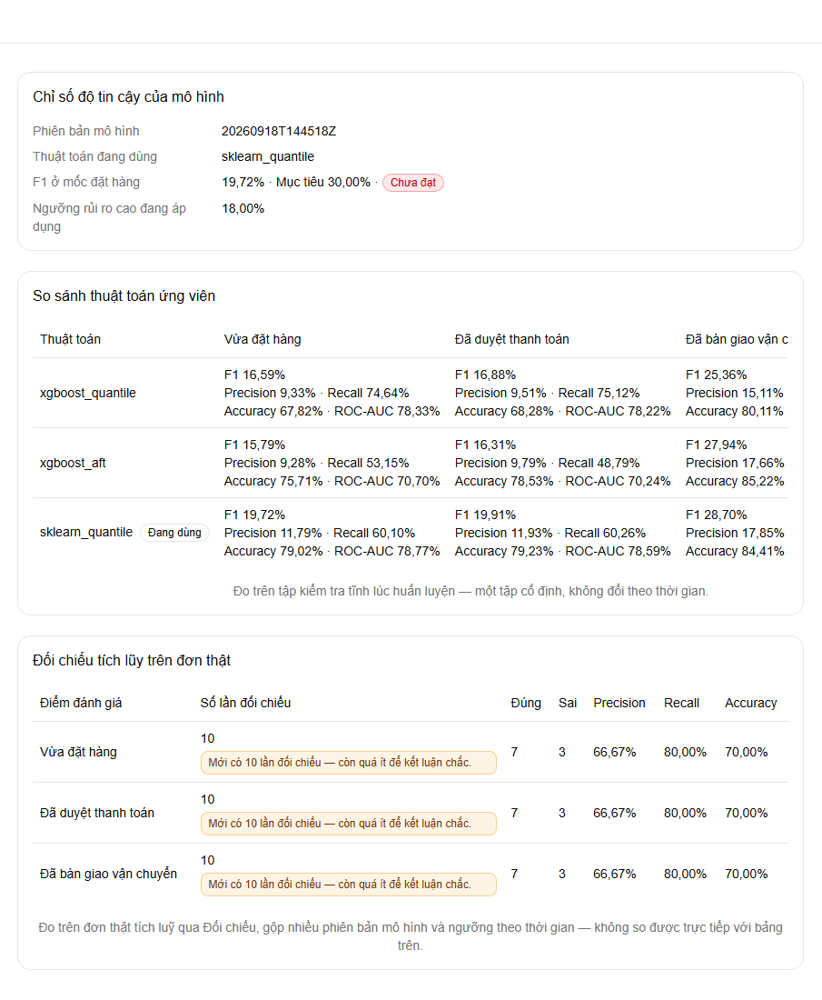

### 4.7 Quản trị tài khoản

Mục "Quản trị" chỉ có với Quản lý hậu cần và Super Admin. Trang liệt kê tài khoản với tên, email, vai trò và trạng thái ("Đang hoạt động" hoặc "Đã khóa"); tài khoản của chính người đang đăng nhập có nhãn "(bạn)" (Hình 4.13).

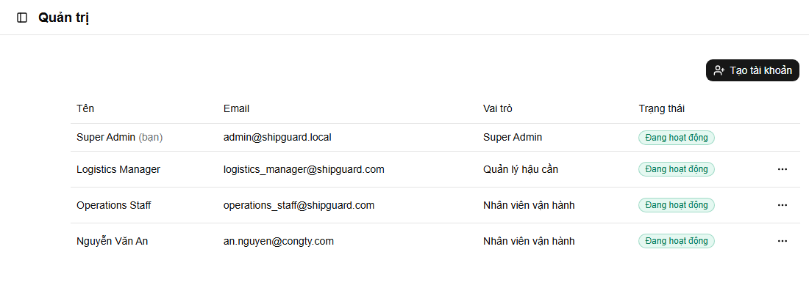

#### 4.7.1 Tạo tài khoản

Bấm "Tạo tài khoản", điền "Tên hiển thị", "Email" (đúng dạng `ten@congty.com`), "Vai trò" và "Mật khẩu ban đầu" (tối thiểu 8 ký tự), rồi bấm "Tạo" (Hình 4.14). Người mới đăng nhập được ngay. Quản lý hậu cần chỉ tạo được tài khoản Nhân viên vận hành. Hệ thống chỉ có một Super Admin.

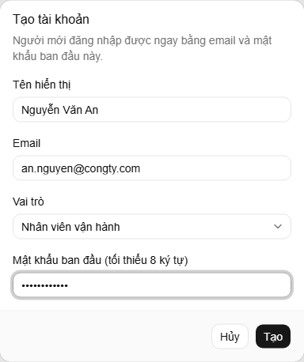

#### 4.7.2 Menu thao tác

Dấu "..." ở cuối mỗi dòng mở menu thao tác (Hình 4.15). "Đổi vai trò" chỉ Super Admin dùng được. "Khóa tài khoản" làm tài khoản không đăng nhập được nữa, các phiên đang mở bị đăng xuất chậm nhất sau 15 phút; "Mở khóa" cho phép đăng nhập trở lại. "Đặt lại mật khẩu" cho nhập mật khẩu mới hai lần rồi bấm "Lưu", các phiên đang mở của tài khoản đó cũng bị đăng xuất chậm nhất sau 15 phút. Quản lý hậu cần chỉ thao tác được trên tài khoản Nhân viên vận hành; với các tài khoản khác, dấu "..." không hiện.

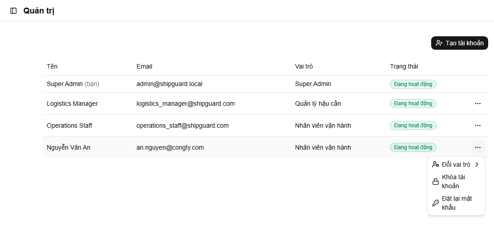

## 5. Phụ lục

### 5.1 Địa chỉ các dịch vụ

Giao diện chạy tại http://localhost:3000. Tài liệu API (Swagger) ở http://localhost:8000/docs, và địa chỉ http://localhost:8000/health cho biết máy chủ xử lý còn sống hay không. Cơ sở dữ liệu PostgreSQL ở localhost:5432.

### 5.2 Cấu trúc thư mục

Trong thư mục `Source`, `backend/` là máy chủ xử lý (FastAPI), `frontend/` là giao diện web (Next.js), `models/` chứa mô hình dự đoán đã huấn luyện và `db/initdb/` chứa bản dữ liệu tự nạp vào cơ sở dữ liệu ở lần chạy đầu. Tệp `docker-compose.yml` khai báo ba dịch vụ để chạy bằng một lệnh, tệp `.env` chứa cấu hình và mật khẩu của hệ thống, còn `README.md` là hướng dẫn ngắn dành cho lập trình viên.
