# CHƯƠNG 2. PHÂN TÍCH VÀ THIẾT KẾ HỆ THỐNG

Chương này trình bày hệ thống được thiết kế ra sao để giải quyết bài toán đã phát biểu ở Chương 1, đi từ yêu cầu phần mềm — ai dùng hệ thống và dùng để làm gì — đến hành vi hệ thống thể hiện qua các sơ đồ Use-case, Activity, Sequence, và cuối cùng là thiết kế cơ sở dữ liệu làm nền tảng lưu trữ.

## 2.1. Xác định và mô hình hóa yêu cầu phần mềm

ShipGuard chỉ có ba tác nhân, và cả ba đều là con người — hệ thống không có tiến trình nền hay dịch vụ ngoài nào tự động gọi vào, mọi thao tác đều xuất phát từ một trong ba vai trò dưới đây.

| STT | Tên tác nhân | Mô tả |
| --- | --- | --- |
| 1 | Operations Staff | Nhân viên vận hành, chịu trách nhiệm quản lý đơn hàng và can thiệp khi có rủi ro giao trễ. |
| 2 | Logistics Manager | Quản lý cấp trung, giám sát toàn bộ hoạt động và quản lý người dùng hệ thống. |
| 3 | Super Admin | Quản trị viên hệ thống, phụ trách đổi vai trò và đặt lại mật khẩu cho tài khoản người dùng; là tài khoản duy nhất không ai khoá hay thay đổi được. |

Ở cấp độ nghiệp vụ, hệ thống được tổ chức thành tám use-case cha — mỗi use-case là một hành động hoàn chỉnh, tự thân mang lại giá trị cho tác nhân thực hiện nó.

| Vai trò | STT | Tên use-case | Mô tả |
| --- | --- | --- | --- |
| Chung | 1 | Đăng nhập | Đăng nhập vào hệ thống. |
| | 2 | Đăng xuất | Đăng xuất khỏi hệ thống. |
| | 3 | Đổi mật khẩu | Thay đổi mật khẩu của tài khoản đang đăng nhập. |
| Nghiệp vụ cốt lõi | 4 | Xem Dashboard hiệu suất | Xem KPI giao hàng, xu hướng theo thời gian, so sánh giữa các kỳ. |
| | 5 | Quản lý đơn hàng | Tra cứu, lọc, xuất CSV, tạo mới, xem chi tiết, ghi nhận/sửa mốc vòng đời, hủy, ghi chú nội bộ đơn hàng. |
| | 6 | Quản lý đánh giá rủi ro | Xem đánh giá rủi ro và lịch sử, ghi nhận biện pháp can thiệp, lọc theo mức rủi ro và trạng thái xử lý. |
| | 7 | Xem trang chỉ số độ tin cậy mô hình | Theo dõi độ tin cậy của mô hình dự báo, so sánh với kết quả giao hàng thực tế. |
| Quản trị | 8 | Quản lý tài khoản người dùng | Tạo, khoá/mở khoá, đặt lại mật khẩu, đổi vai trò tài khoản người dùng. |

Bảng dưới đây ánh xạ chi tiết use-case nào thuộc về tác nhân nào — phần lớn nghiệp vụ cốt lõi dùng chung cho cả ba vai trò, riêng việc quản lý tài khoản người dùng chỉ dành cho Logistics Manager và Super Admin, còn việc đổi vai trò của một tài khoản thì chỉ Super Admin mới thực hiện được.

| Tác nhân | STT | Use-case | Mô tả |
| --- | --- | --- | --- |
| Operations Staff | 1 | Đăng nhập | Đăng nhập vào hệ thống. |
| | 2 | Đăng xuất | Đăng xuất khỏi hệ thống. |
| | 3 | Đổi mật khẩu | Thay đổi mật khẩu của tài khoản đang đăng nhập. |
| | 4 | Xem Dashboard hiệu suất | Xem KPI giao hàng, xu hướng theo thời gian, so sánh giữa các kỳ. |
| | 5 | Quản lý đơn hàng | Tra cứu, lọc, xuất CSV, tạo mới, xem chi tiết, ghi nhận/sửa mốc vòng đời, hủy, ghi chú nội bộ đơn hàng. |
| | 6 | Quản lý đánh giá rủi ro | Xem đánh giá rủi ro và lịch sử, ghi nhận biện pháp can thiệp, lọc theo mức rủi ro và trạng thái xử lý. |
| | 7 | Xem trang chỉ số độ tin cậy mô hình | Theo dõi độ tin cậy của mô hình dự báo, so sánh với kết quả giao hàng thực tế. |
| Logistics Manager | 1 | Đăng nhập | Đăng nhập vào hệ thống. |
| | 2 | Đăng xuất | Đăng xuất khỏi hệ thống. |
| | 3 | Đổi mật khẩu | Thay đổi mật khẩu của tài khoản đang đăng nhập. |
| | 4 | Xem Dashboard hiệu suất | Xem KPI giao hàng, xu hướng theo thời gian, so sánh giữa các kỳ. |
| | 5 | Quản lý đơn hàng | Tra cứu, lọc, xuất CSV, tạo mới, xem chi tiết, ghi nhận/sửa mốc vòng đời, hủy, ghi chú nội bộ đơn hàng. |
| | 6 | Quản lý đánh giá rủi ro | Xem đánh giá rủi ro và lịch sử, ghi nhận biện pháp can thiệp, lọc theo mức rủi ro và trạng thái xử lý. |
| | 7 | Xem trang chỉ số độ tin cậy mô hình | Theo dõi độ tin cậy của mô hình dự báo, so sánh với kết quả giao hàng thực tế. |
| | 8 | Quản lý tài khoản người dùng | Tạo, khoá/mở khoá, đặt lại mật khẩu tài khoản người dùng. |
| Super Admin | 1 | Đăng nhập | Đăng nhập vào hệ thống. |
| | 2 | Đăng xuất | Đăng xuất khỏi hệ thống. |
| | 3 | Đổi mật khẩu | Thay đổi mật khẩu của tài khoản đang đăng nhập. |
| | 4 | Xem Dashboard hiệu suất | Xem KPI giao hàng, xu hướng theo thời gian, so sánh giữa các kỳ. |
| | 5 | Quản lý đơn hàng | Tra cứu, lọc, xuất CSV, tạo mới, xem chi tiết, ghi nhận/sửa mốc vòng đời, hủy, ghi chú nội bộ đơn hàng. |
| | 6 | Quản lý đánh giá rủi ro | Xem đánh giá rủi ro và lịch sử, ghi nhận biện pháp can thiệp, lọc theo mức rủi ro và trạng thái xử lý. |
| | 7 | Xem trang chỉ số độ tin cậy mô hình | Theo dõi độ tin cậy của mô hình dự báo, so sánh với kết quả giao hàng thực tế. |
| | 8 | Quản lý tài khoản người dùng | Tạo, khoá/mở khoá, đặt lại mật khẩu, đổi vai trò tài khoản người dùng. |

## 2.2. Sơ đồ Use-case

Mỗi use-case cha ở trên còn được chia nhỏ thành các hành động con — thao tác cụ thể nằm bên trong use-case cha, ví dụ "Tạo đơn hàng mới" là một hành động con của "Quản lý đơn hàng". Trong sơ đồ, use-case cha vẽ bằng ellipse lớn nối thẳng với tác nhân bằng một đường liền, còn hành động con vẽ bằng ellipse nhỏ hơn, nối vào use-case cha của nó bằng mũi tên nét đứt mang nhãn `«extend»`. Riêng quan hệ `«include»` — khác với `«extend»` ở chỗ gắn liền với chính hành vi của use-case gọi, không phải một thao tác tuỳ chọn thêm vào — chỉ xuất hiện một lần: hành động "Ghi nhận mốc vòng đời đơn hàng" kéo theo việc đối chiếu kết quả dự đoán; nhánh rẽ cụ thể theo loại mốc được trình bày trong sơ đồ Activity ở mục 2.3.5.

Bốn sơ đồ dưới đây trình bày cùng một tập quan hệ actor – use-case, nhìn từ bốn góc: một sơ đồ tổng quát gộp cả ba tác nhân, và ba sơ đồ còn lại tách riêng theo từng tác nhân để dễ đọc.

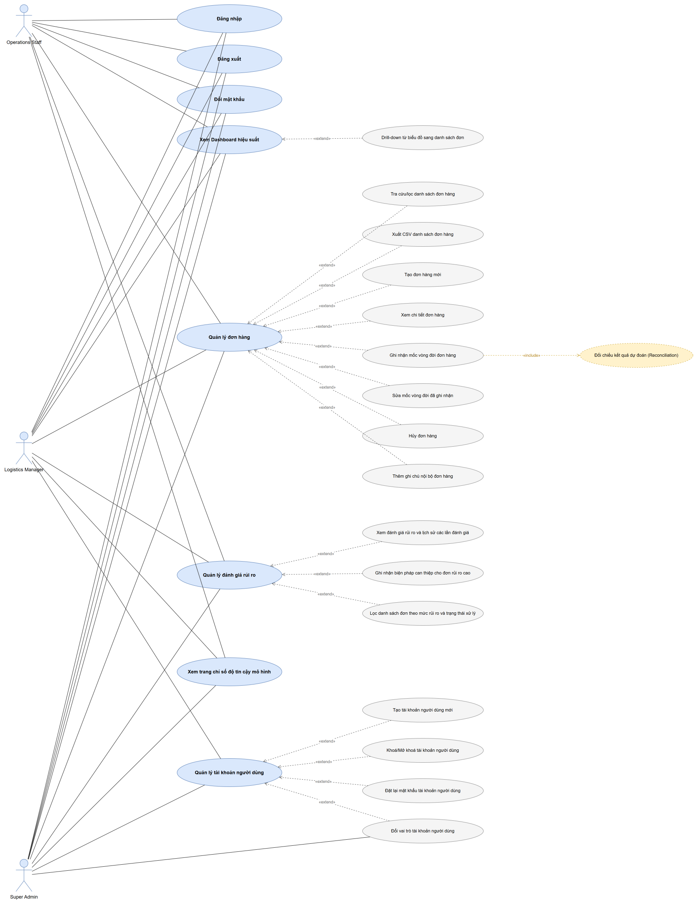

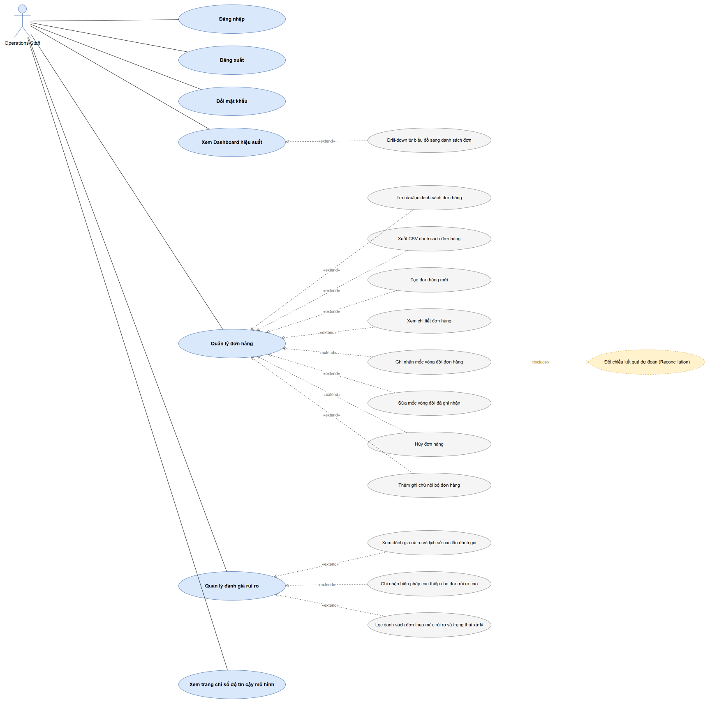

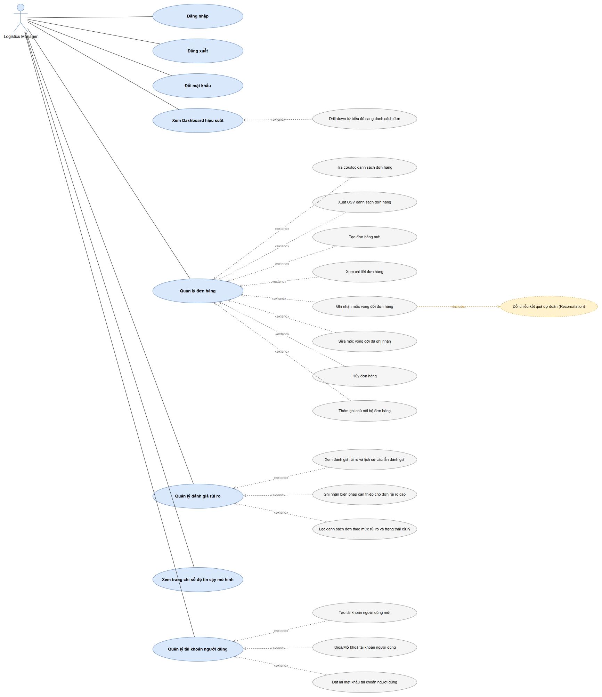

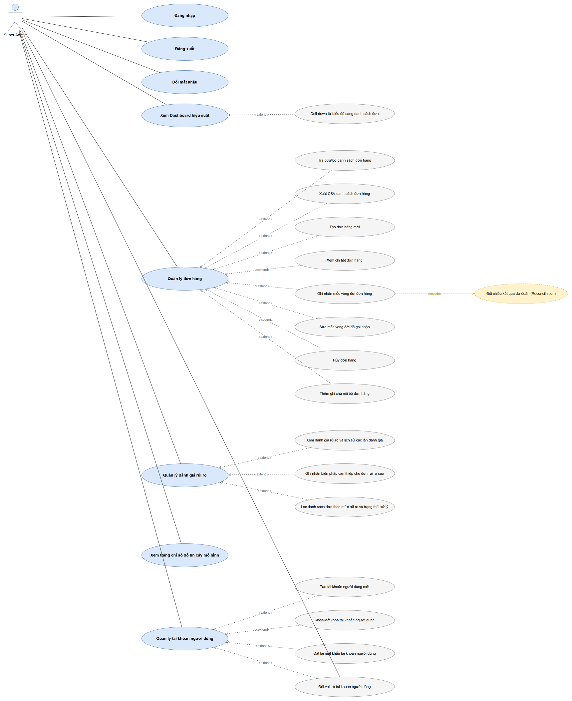

## 2.3. Sơ đồ Activity

Mỗi use-case cha được minh hoạ bằng một sơ đồ Activity riêng, trình bày dưới dạng ba làn dọc song song — Người dùng, Hệ thống, Cơ sở dữ liệu — với luồng xử lý chảy từ trên xuống dưới.

### 2.3.1. Đăng nhập

Người dùng nhập email và mật khẩu; hệ thống tra tài khoản theo email và từ chối bằng một thông báo lỗi chung — không phân biệt tài khoản không tồn tại, đã bị khoá, hay sai mật khẩu — trước khi cấp token và đưa người dùng vào Dashboard nếu thông tin hợp lệ.

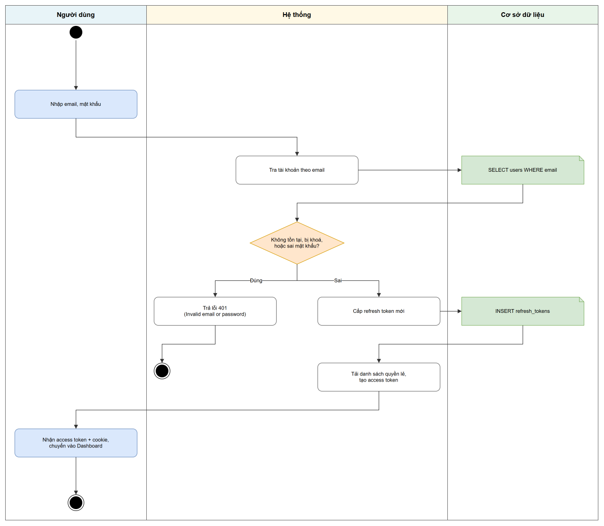

### 2.3.2. Đăng xuất

Hệ thống thu hồi refresh token hiện có của phiên đăng nhập, nếu có, rồi xoá cookie và đưa người dùng về lại trang đăng nhập.

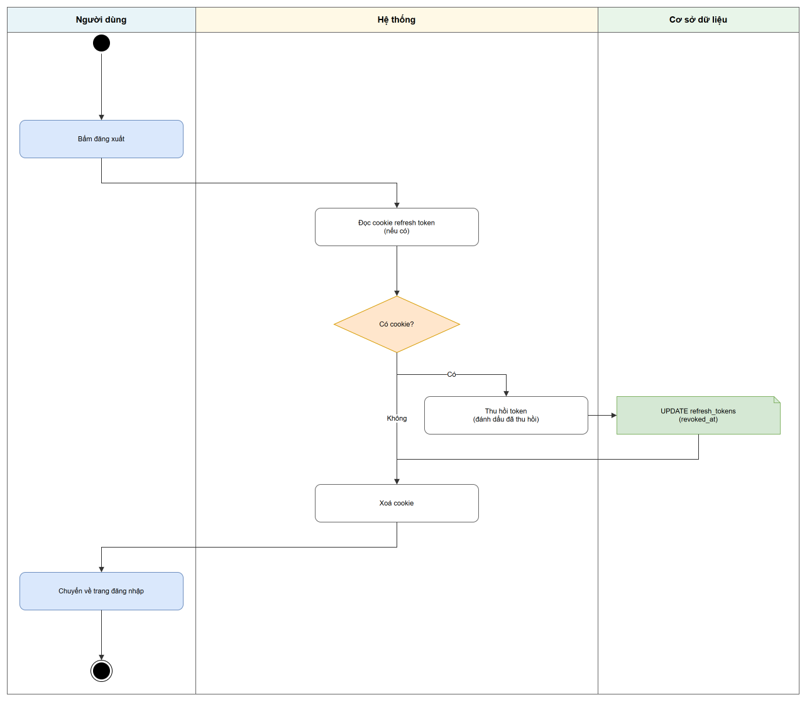

### 2.3.3. Đổi mật khẩu

Sau khi kiểm tra độ dài mật khẩu mới và xác minh đúng mật khẩu hiện tại, hệ thống cập nhật mật khẩu, thu hồi toàn bộ phiên đăng nhập cũ và cấp lại một phiên mới cho người dùng.

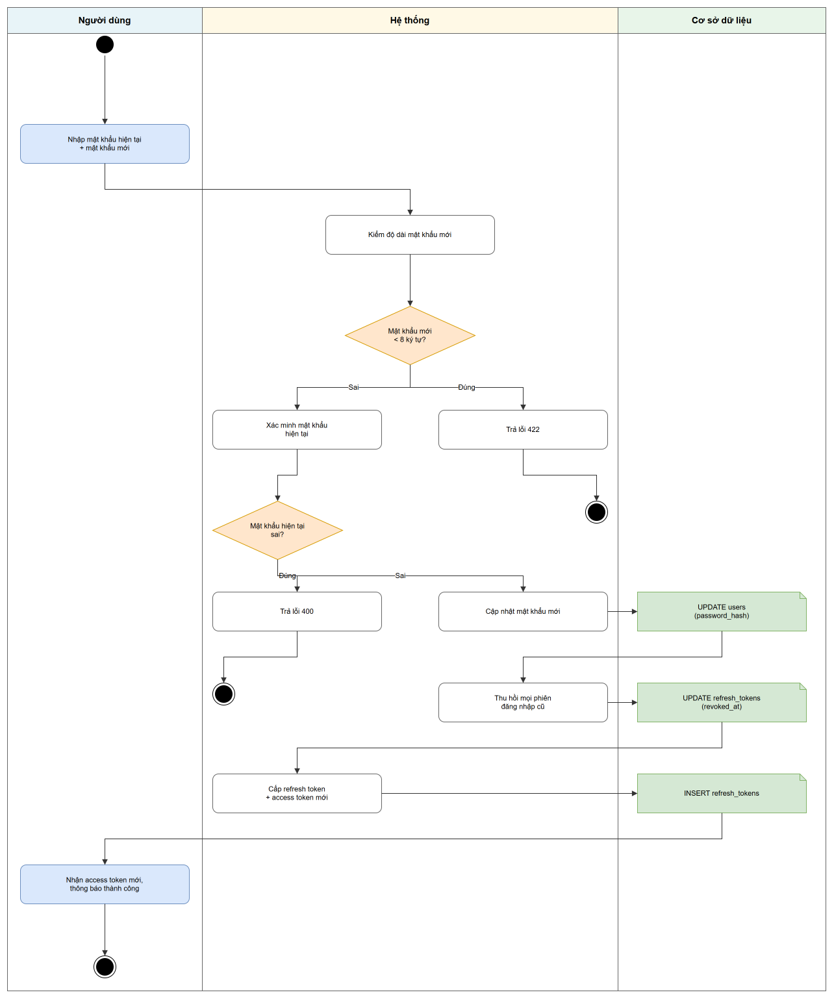

### 2.3.4. Xem Dashboard hiệu suất

Hệ thống tính các chỉ số KPI, xu hướng theo thời gian và phân bố theo bang cho kỳ báo cáo hiện tại, tính thêm cho kỳ đối chiếu nếu người dùng có chọn so sánh, trước khi trả kết quả; từ biểu đồ, người dùng có thể bấm vào một điểm để chuyển sang màn hình Quản lý đơn hàng với đúng bộ lọc tương ứng.

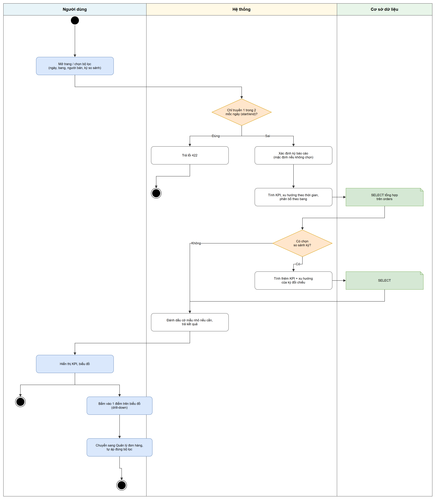

### 2.3.5. Quản lý đơn hàng

Đây là use-case cha có nhiều hành động con nhất, nên người dùng cần chọn trước một trong tám thao tác cụ thể, mỗi thao tác rẽ theo một nhánh xử lý riêng. Đáng chú ý nhất là việc tạo đơn hàng mới — phải qua ba bước kiểm tra liên tiếp về định dạng dữ liệu, sự tồn tại của người bán/danh mục/bang, và mã bưu chính người bán trước khi được ghi nhận — và việc ghi nhận mốc vòng đời, nơi hệ thống rẽ nhánh khác nhau tuỳ mốc vừa ghi có phải là mốc giao hàng cuối cùng hay không: nếu phải, hệ thống đối chiếu lại toàn bộ lịch sử đánh giá rủi ro của đơn với kết quả giao hàng thật; nếu không, hệ thống tính một đánh giá rủi ro mới.

*Sơ đồ này rất dài do gộp đủ tám nhánh thao tác trong cùng một hình; bản trong báo cáo được thu nhỏ để vừa trang, xem file gốc tại `docs/report/diagrams/2.3.5-quan-ly-don-hang.drawio` để đọc rõ từng nhánh.*

### 2.3.6. Quản lý đánh giá rủi ro

Người dùng chọn giữa xem lại lịch sử đánh giá rủi ro của một đơn, hoặc ghi nhận một biện pháp can thiệp cho đơn đang ở mức rủi ro cao; việc ghi nhận can thiệp chỉ thành công khi đơn còn đang ở mức rủi ro cao, chưa từng được xử lý, chưa bị một lần đánh giá mới hơn thay thế, và đơn chưa bị huỷ.

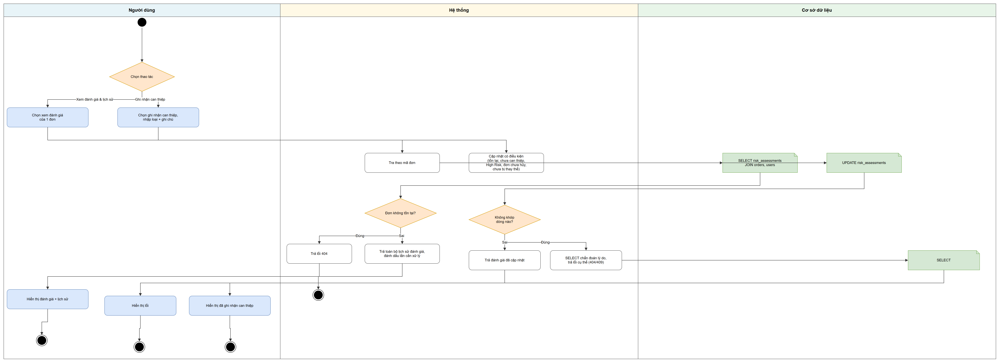

### 2.3.7. Xem trang chỉ số độ tin cậy mô hình

Hệ thống đồng thời đọc báo cáo huấn luyện gần nhất từ tệp tĩnh trên đĩa và tính bảng đối chiếu tích luỹ dựa trên kết quả giao hàng thật, rồi trả cả hai phần cho người dùng trong cùng một lần xem.

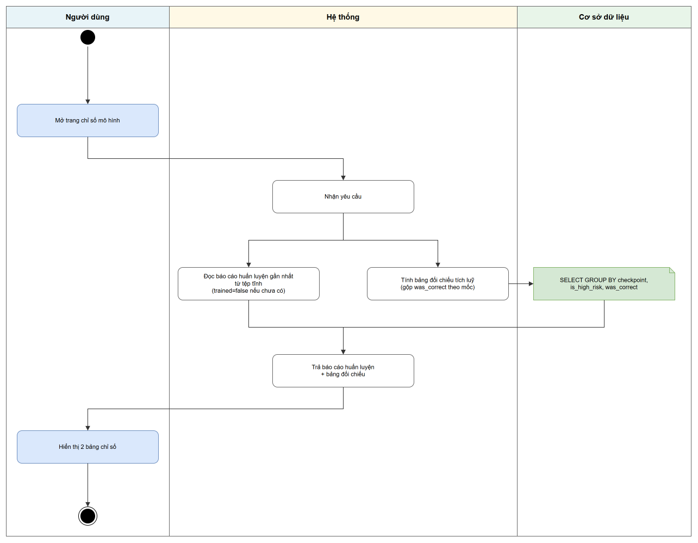

### 2.3.8. Quản lý tài khoản người dùng

Người dùng quản trị chọn giữa việc tạo một tài khoản mới hoặc cập nhật một tài khoản đã có — khoá/mở khoá, đổi vai trò, và/hoặc đặt lại mật khẩu đều dùng chung một luồng cập nhật duy nhất. Luồng cập nhật đi qua một loạt kiểm tra chung — tài khoản mục tiêu tồn tại, không phải là Super Admin, và người gọi có đúng phạm vi vai trò để chạm vào tài khoản đó — trước khi kiểm thêm điều kiện riêng cho việc đổi vai trò: chỉ Super Admin mới được thực hiện, bất kể mục tiêu là ai.

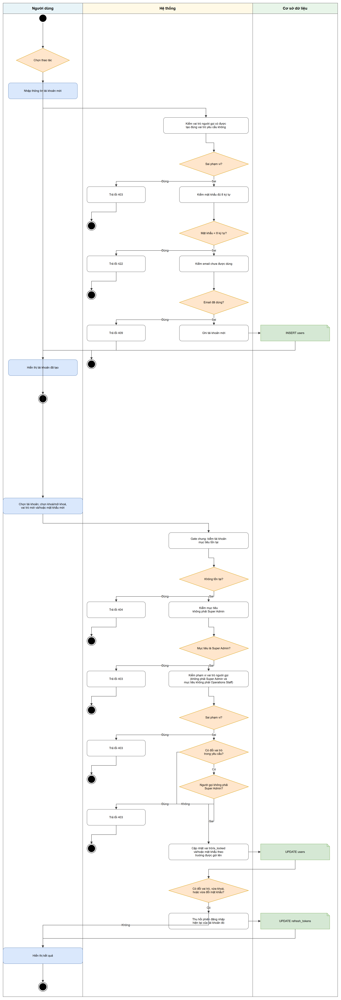

*Sơ đồ này cũng khá dài do gộp cả nhánh tạo tài khoản mới lẫn nhánh cập nhật tài khoản; bản trong báo cáo được thu nhỏ để vừa trang, xem file gốc tại `docs/report/diagrams/2.3.8-quan-ly-tai-khoan.drawio` để đọc rõ từng bước.*

## 2.4. Sơ đồ Sequence

Tám sơ đồ dưới đây trình bày nhánh xử lý tiêu biểu nhất của từng use-case cha, theo mô hình Boundary-Control-Entity: lifeline actor là tác nhân thao tác; boundary là màn hình giao diện; control tách thành hai tầng đúng kiến trúc thật của hệ thống — router tiếp nhận HTTP và ánh xạ lỗi, service chứa nghiệp vụ; entity là tên bảng cơ sở dữ liệu thật mà nghiệp vụ đó chạm tới.

### 2.4.1. Đăng nhập

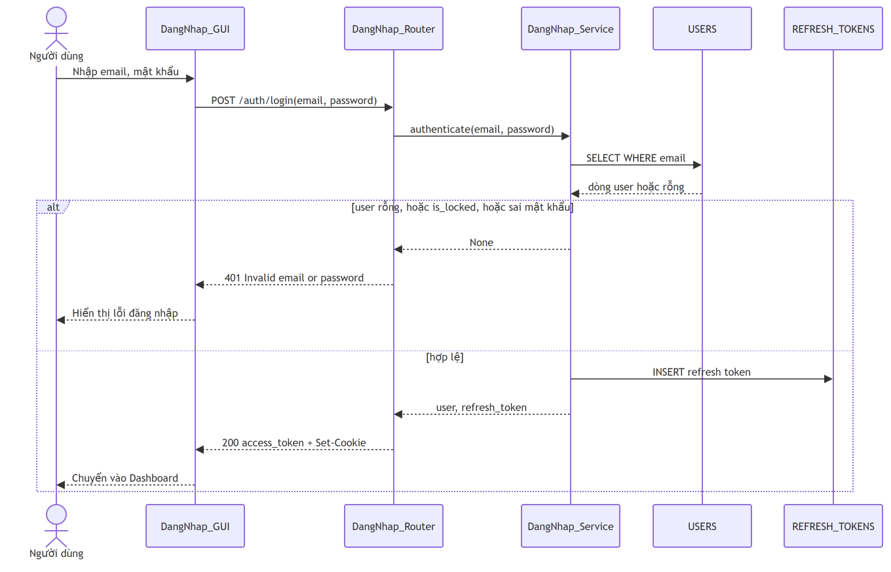

### 2.4.2. Đăng xuất

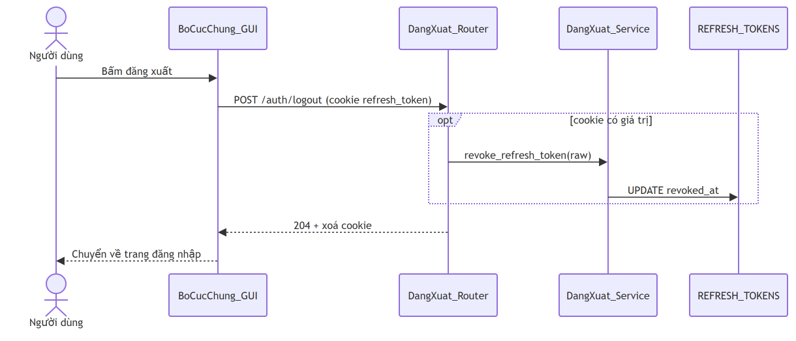

### 2.4.3. Đổi mật khẩu

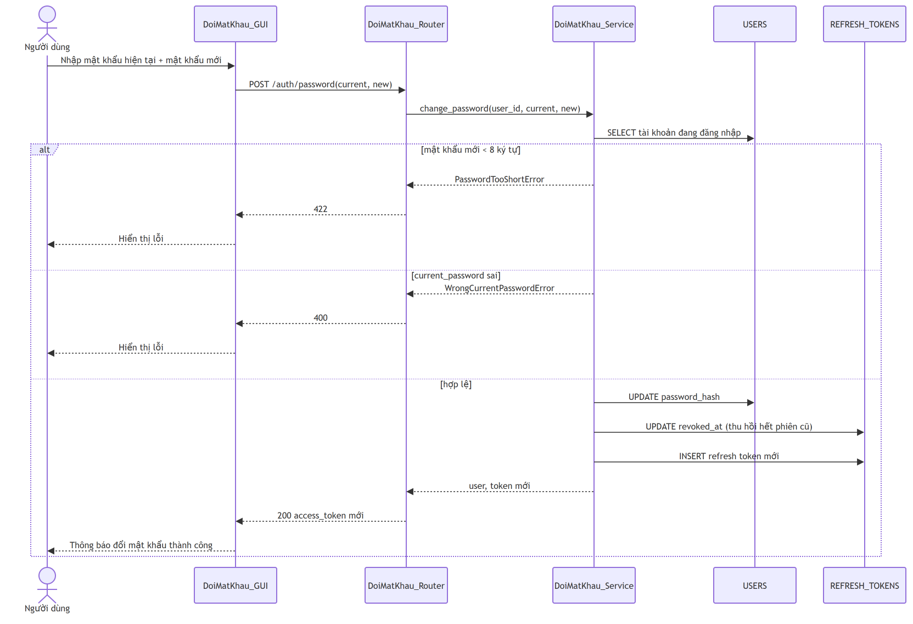

### 2.4.4. Xem Dashboard hiệu suất

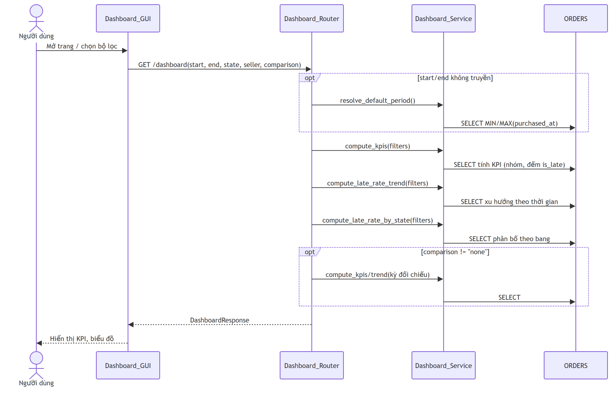

### 2.4.5. Quản lý đơn hàng

Nhánh tiêu biểu được chọn là ghi nhận mốc vòng đời — nhánh phức tạp nhất, có rẽ hướng giữa việc đối chiếu lịch sử đánh giá và việc tính một đánh giá rủi ro mới.

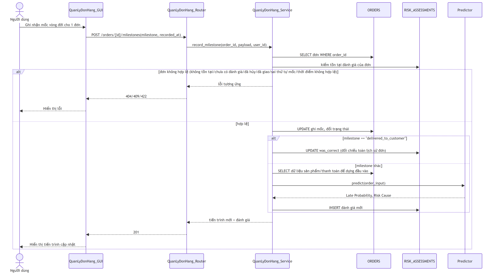

### 2.4.6. Quản lý đánh giá rủi ro

Nhánh tiêu biểu được chọn là ghi nhận biện pháp can thiệp.

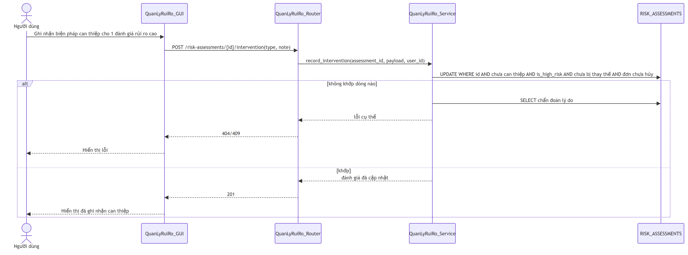

### 2.4.7. Xem trang chỉ số độ tin cậy mô hình

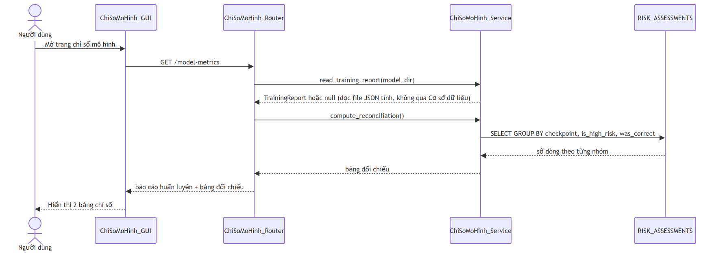

### 2.4.8. Quản lý tài khoản người dùng

Nhánh tiêu biểu được chọn là khoá/mở khoá hoặc đổi vai trò — cả Logistics Manager lẫn Super Admin đều thực hiện được đúng luồng này, chỉ khác nhau ở phạm vi vai trò được phép chạm tới.

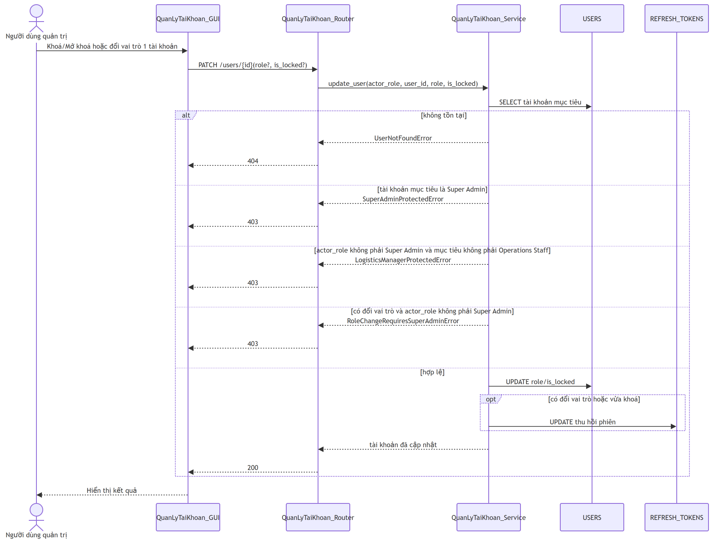

## 2.5. Thiết kế cơ sở dữ liệu

Cơ sở dữ liệu của ShipGuard gồm mười hai bảng. Để nhất quán xuyên suốt mục này, khoá chính dạng tự tăng được hiển thị theo quy ước `<tên bảng>_id` (ví dụ `user_id`, `risk_assessment_id`) dù tên cột thật trong cơ sở dữ liệu của một số bảng chỉ là `id` — cách đặt tên hiển thị này không làm thay đổi cấu trúc thật, chỉ giúp tên gọi rõ ràng hơn khi đọc độc lập từng bảng.

### 2.5.1. Bảng `users`

| Tên trường | Kiểu dữ liệu | Ràng buộc | Mô tả |
| --- | --- | --- | --- |
| user_id (Khóa chính) | bigint | Khóa chính, tự tăng | Mã tài khoản |
| email | text | Không được rỗng; duy nhất, không phân biệt hoa/thường | Email đăng nhập |
| display_name | text | Không được rỗng | Tên hiển thị |
| password_hash | text | Không được rỗng | Mật khẩu đã băm |
| role | text | Không được rỗng; chỉ nhận operations_staff/logistics_manager/super_admin; toàn hệ thống chỉ 1 dòng super_admin | Vai trò tài khoản |
| is_locked | boolean | Không được rỗng, mặc định false | Tài khoản có đang bị khoá không |
| created_at | timestamptz | Không được rỗng, mặc định thời điểm hiện tại | Thời điểm tạo tài khoản |

### 2.5.2. Bảng `refresh_tokens`

| Tên trường | Kiểu dữ liệu | Ràng buộc | Mô tả |
| --- | --- | --- | --- |
| refresh_token_id (Khóa chính) | bigint | Khóa chính, tự tăng | Mã token |
| user_id | bigint | Không được rỗng; khóa ngoại tới `users.user_id` | Tài khoản sở hữu token |
| token_hash | text | Không được rỗng, duy nhất | Giá trị băm của refresh token |
| expires_at | timestamptz | Không được rỗng | Thời điểm hết hạn |
| revoked_at | timestamptz | Có thể rỗng | Thời điểm bị thu hồi (nếu có) |
| created_at | timestamptz | Không được rỗng, mặc định thời điểm hiện tại | Thời điểm tạo token |

### 2.5.3. Bảng `user_claims`

| Tên trường | Kiểu dữ liệu | Ràng buộc | Mô tả |
| --- | --- | --- | --- |
| user_id (Khóa chính) | bigint | Khóa chính kết hợp; khóa ngoại tới `users.user_id` | Tài khoản được cấp quyền lẻ |
| claim (Khóa chính) | text | Khóa chính kết hợp; không được rỗng | Tên quyền lẻ cấp thêm ngoài vai trò |
| created_at | timestamptz | Không được rỗng, mặc định thời điểm hiện tại | Thời điểm cấp quyền |

### 2.5.4. Bảng `orders`

| Tên trường | Kiểu dữ liệu | Ràng buộc | Mô tả |
| --- | --- | --- | --- |
| order_id (Khóa chính) | text | Khóa chính | Mã đơn hàng |
| order_status | text | Không được rỗng | Trạng thái đơn hàng |
| customer_state | text | Không được rỗng | Bang giao hàng của khách |
| customer_city | text | Có thể rỗng | Thành phố giao hàng |
| customer_zip_code_prefix | text | Có thể rỗng | Mã bưu chính giao hàng |
| purchased_at | timestamp | Không được rỗng | Thời điểm đặt hàng |
| payment_approved_at | timestamp | Có thể rỗng | Thời điểm thanh toán được duyệt |
| handed_to_carrier_at | timestamp | Có thể rỗng | Thời điểm bàn giao cho đơn vị vận chuyển |
| delivered_to_customer_at | timestamp | Có thể rỗng | Thời điểm giao đến khách |
| estimated_delivery_date | date | Không được rỗng | Ngày dự kiến giao hàng |
| worst_review_score | smallint | Có thể rỗng | Điểm đánh giá thấp nhất của đơn |
| order_value | numeric(12,2) | Có thể rỗng | Tổng giá trị đơn hàng |
| payment_approval | interval | Cột sinh tự động (chênh lệch giữa thời điểm duyệt thanh toán và thời điểm đặt hàng) | Thời gian duyệt thanh toán |
| seller_handling | interval | Cột sinh tự động (chênh lệch giữa thời điểm bàn giao vận chuyển và thời điểm duyệt thanh toán) | Thời gian người bán xử lý |
| carrier_transit | interval | Cột sinh tự động (chênh lệch giữa thời điểm giao đến khách và thời điểm bàn giao vận chuyển) | Thời gian vận chuyển |
| is_late | boolean | Cột sinh tự động (so sánh thời điểm giao đến khách với ngày dự kiến giao hàng) | Đơn có giao trễ so với ngày dự kiến không |

### 2.5.5. Bảng `order_sellers`

| Tên trường | Kiểu dữ liệu | Ràng buộc | Mô tả |
| --- | --- | --- | --- |
| order_id (Khóa chính) | text | Khóa chính kết hợp; khóa ngoại tới `orders.order_id` | Mã đơn hàng |
| seller_id (Khóa chính) | text | Khóa chính kết hợp | Mã người bán tham gia đơn |

### 2.5.6. Bảng `sellers`

| Tên trường | Kiểu dữ liệu | Ràng buộc | Mô tả |
| --- | --- | --- | --- |
| seller_id (Khóa chính) | text | Khóa chính | Mã người bán |
| seller_city | text | Không được rỗng | Thành phố người bán |
| seller_state | text | Không được rỗng | Bang người bán gửi hàng đi |
| seller_zip_code_prefix | text | Có thể rỗng | Mã bưu chính người bán |

### 2.5.7. Bảng `order_items`

| Tên trường | Kiểu dữ liệu | Ràng buộc | Mô tả |
| --- | --- | --- | --- |
| order_id (Khóa chính) | text | Khóa chính kết hợp; khóa ngoại tới `orders.order_id` | Mã đơn hàng |
| order_item_id (Khóa chính) | integer | Khóa chính kết hợp | Số thứ tự sản phẩm trong đơn |
| product_id | text | Không được rỗng | Mã sản phẩm |
| product_category_name | text | Có thể rỗng | Tên danh mục sản phẩm (bản gốc) |
| product_weight_g | integer | Có thể rỗng | Khối lượng sản phẩm (gram) |
| price | numeric(12,2) | Không được rỗng | Đơn giá sản phẩm |
| freight_value | numeric(12,2) | Không được rỗng | Phí vận chuyển của sản phẩm |
| seller_id | text | Không được rỗng | Mã người bán |

### 2.5.8. Bảng `order_payments`

| Tên trường | Kiểu dữ liệu | Ràng buộc | Mô tả |
| --- | --- | --- | --- |
| order_id (Khóa chính) | text | Khóa chính kết hợp; khóa ngoại tới `orders.order_id` | Mã đơn hàng |
| payment_sequential (Khóa chính) | integer | Khóa chính kết hợp | Số thứ tự lần thanh toán |
| payment_type | text | Không được rỗng | Hình thức thanh toán |
| payment_installments | integer | Không được rỗng | Số kỳ trả góp |
| payment_value | numeric(12,2) | Không được rỗng | Giá trị thanh toán |

### 2.5.9. Bảng `order_reviews`

| Tên trường | Kiểu dữ liệu | Ràng buộc | Mô tả |
| --- | --- | --- | --- |
| order_id (Khóa chính) | text | Khóa chính kết hợp; khóa ngoại tới `orders.order_id` | Mã đơn hàng |
| review_sequential (Khóa chính) | integer | Khóa chính kết hợp | Số thứ tự đánh giá (một đơn có thể có nhiều đánh giá) |
| review_score | smallint | Không được rỗng | Điểm đánh giá |
| comment_title | text | Có thể rỗng | Tiêu đề nhận xét |
| comment_message | text | Có thể rỗng | Nội dung nhận xét |
| review_created_at | timestamp | Không được rỗng | Thời điểm tạo đánh giá (theo dữ liệu gốc) |

### 2.5.10. Bảng `product_categories`

| Tên trường | Kiểu dữ liệu | Ràng buộc | Mô tả |
| --- | --- | --- | --- |
| product_category_name (Khóa chính) | text | Khóa chính | Tên danh mục sản phẩm (bản gốc) |
| product_category_name_english | text | Không được rỗng | Tên danh mục sản phẩm (tiếng Anh) |

### 2.5.11. Bảng `order_notes`

| Tên trường | Kiểu dữ liệu | Ràng buộc | Mô tả |
| --- | --- | --- | --- |
| order_note_id (Khóa chính) | bigint | Khóa chính, tự tăng | Mã ghi chú |
| order_id | text | Không được rỗng; cố ý không có khóa ngoại (xem ghi chú thiết kế bên dưới) | Mã đơn hàng liên quan |
| author_id | bigint | Không được rỗng; khóa ngoại tới `users.user_id` | Người viết ghi chú |
| body | text | Không được rỗng, độ dài 1–2000 ký tự | Nội dung ghi chú |
| created_at | timestamptz | Không được rỗng, mặc định thời điểm hiện tại | Thời điểm tạo ghi chú |

### 2.5.12. Bảng `risk_assessments`

| Tên trường | Kiểu dữ liệu | Ràng buộc | Mô tả |
| --- | --- | --- | --- |
| risk_assessment_id (Khóa chính) | bigint | Khóa chính, tự tăng | Mã lần đánh giá |
| order_id | text | Không được rỗng; cố ý không có khóa ngoại (xem ghi chú thiết kế bên dưới) | Mã đơn hàng được đánh giá |
| checkpoint | text | Không được rỗng; chỉ nhận order_placed/payment_approved/handed_to_carrier | Mốc vòng đời lúc đánh giá |
| assessed_at | timestamptz | Không được rỗng, mặc định thời điểm hiện tại | Thời điểm đánh giá |
| late_probability | double precision | Không được rỗng, trong khoảng 0–1 (bao gồm cả hai đầu mút) | Xác suất giao trễ |
| is_high_risk | boolean | Không được rỗng | Đơn có được xếp rủi ro cao không |
| threshold_used | double precision | Không được rỗng, trong khoảng 0–1 (không bao gồm hai đầu mút) | Ngưỡng rủi ro dùng tại thời điểm đánh giá (snapshot — xem ghi chú thiết kế bên dưới) |
| model_version | text | Không được rỗng | Phiên bản mô hình dùng để đánh giá |
| risk_cause_stage | text | Không được rỗng; chỉ nhận payment_approval/seller_handling/carrier_transit | Chặng được xem là nguyên nhân rủi ro chính |
| risk_cause_seller_id | text | Có thể rỗng — chỉ có giá trị khi nguyên nhân là khâu người bán | Mã người bán liên quan đến nguyên nhân rủi ro |
| payment_approval_median_days | double precision | Có thể rỗng | Trung vị số ngày dự kiến — chặng thanh toán |
| payment_approval_historical_median_days | double precision | Có thể rỗng | Trung vị số ngày lịch sử — chặng thanh toán |
| seller_handling_median_days | double precision | Có thể rỗng | Trung vị số ngày dự kiến — chặng người bán xử lý |
| seller_handling_historical_median_days | double precision | Có thể rỗng | Trung vị số ngày lịch sử — chặng người bán xử lý |
| carrier_transit_median_days | double precision | Có thể rỗng | Trung vị số ngày dự kiến — chặng vận chuyển |
| carrier_transit_historical_median_days | double precision | Có thể rỗng | Trung vị số ngày lịch sử — chặng vận chuyển |
| created_by | bigint | Không được rỗng; khóa ngoại tới `users.user_id` | Người/hệ thống tạo đánh giá |
| intervention | text | Có thể rỗng; chỉ nhận remind_seller/change_carrier/contact_payment/notify_customer/other | Biện pháp can thiệp đã ghi nhận |
| intervention_note | text | Có thể rỗng, tối đa 2000 ký tự | Ghi chú về biện pháp can thiệp |
| handled_by | bigint | Có thể rỗng; khóa ngoại tới `users.user_id` | Người xử lý can thiệp |
| handled_at | timestamptz | Có thể rỗng | Thời điểm xử lý can thiệp |
| was_correct | boolean | Có thể rỗng — chỉ điền khi đối chiếu | Đánh giá có đúng so với kết quả giao hàng thật không |

**Ghi chú thiết kế.** Hai bảng `order_notes` và `risk_assessments` cố tình không đặt khóa ngoại trỏ tới `orders`: cả hai phải sống sót qua bước dựng lại dữ liệu dẫn xuất, khi bảng `orders` bị xoá sạch và tạo lại từ dữ liệu nguồn — nếu có khóa ngoại, bước dựng lại này sẽ bị chặn hoặc kéo theo việc xoá lan dữ liệu không mong muốn; việc kiểm tra đơn có tồn tại hay không được đảm nhiệm ở tầng dịch vụ khi ghi dữ liệu. Riêng trường `risk_assessments.threshold_used` lưu lại đúng ngưỡng rủi ro tại thời điểm đánh giá được thực hiện — đây là một bản chụp nhanh (snapshot), nên nếu về sau hệ thống đổi ngưỡng rủi ro thì các lần đánh giá cũ vẫn giữ nguyên kết quả đã xếp loại, không bị tính lại theo ngưỡng mới.
