# CHƯƠNG 3. MÔ TẢ GIAO DIỆN

## 3.1. Giao diện người dùng vận hành

### 3.1.1. Đăng nhập

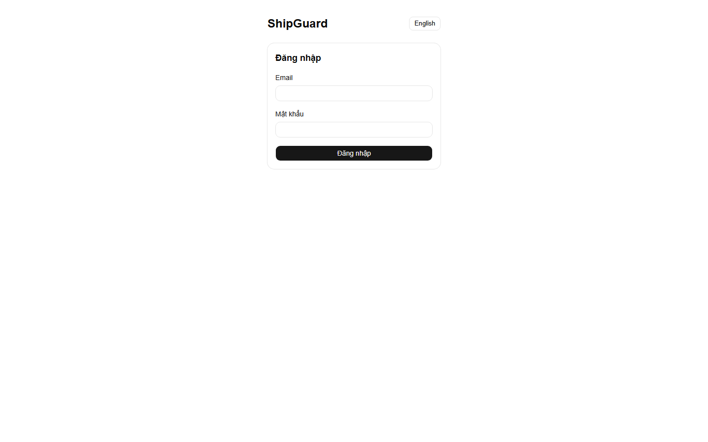

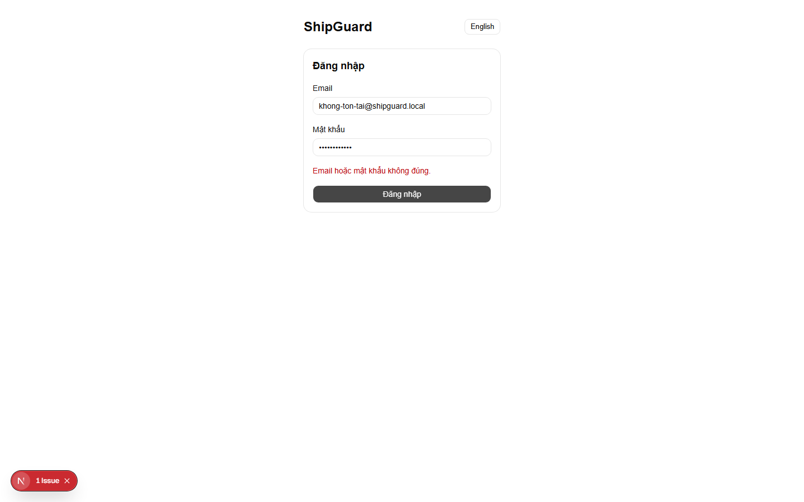

| STT | Thành phần | Chức năng |
| --- | --- | --- |
| 1 | Email | Nhập địa chỉ email để đăng nhập |
| 2 | Mật khẩu | Nhập mật khẩu để đăng nhập |
| 3 | Đăng nhập | Xác nhận đăng nhập bằng thông tin đã nhập |
| 4 | Thông báo lỗi | Hiển thị một thông báo chung khi email hoặc mật khẩu sai, hoặc tài khoản bị khoá — không phân biệt lý do |
| 5 | Chuyển ngôn ngữ | Đổi ngôn ngữ hiển thị Tiếng Việt/English |

### 3.1.2. Dashboard hiệu suất

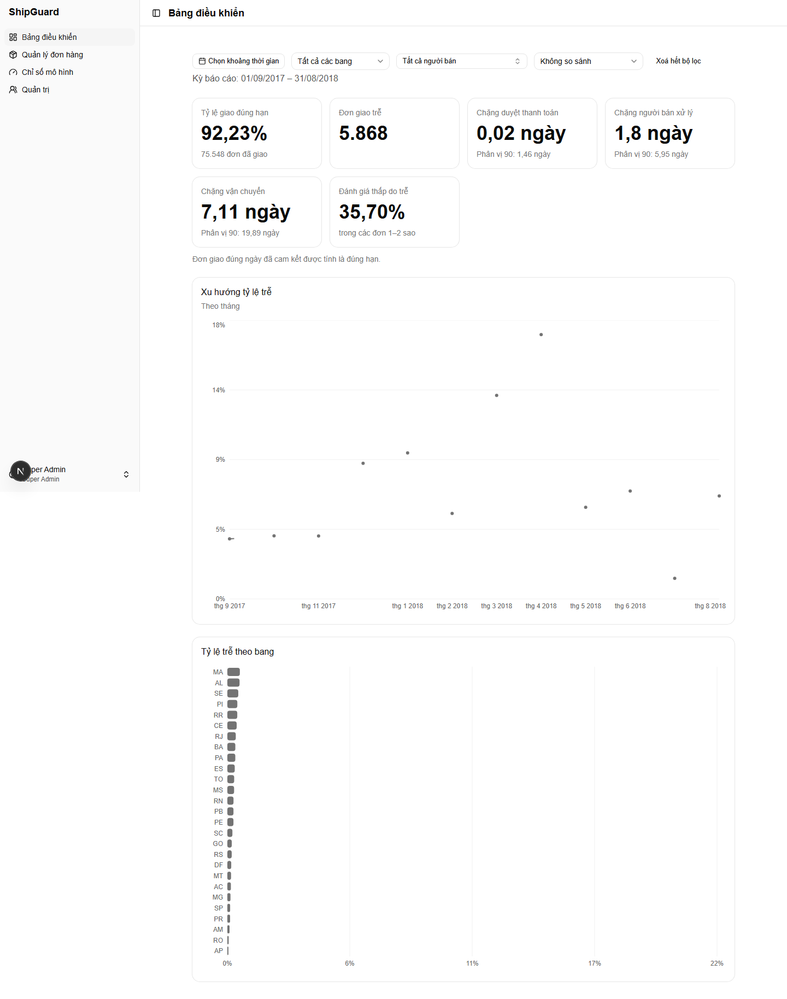

| STT | Thành phần | Chức năng |
| --- | --- | --- |
| 1 | Bộ lọc | Chọn khoảng ngày, bang khách hàng, người bán, kỳ so sánh (không so sánh/kỳ trước/cùng kỳ năm trước) |
| 2 | Thẻ chỉ số hiệu suất | Hiển thị tỷ lệ giao đúng hạn, số đơn trễ, thời gian từng chặng vòng đời, tỷ lệ đánh giá thấp liên quan đến trễ — kèm mức chênh lệch so với kỳ đối chiếu nếu có chọn |
| 3 | Cảnh báo mẫu nhỏ | Hiển thị khi số đơn trong kỳ đang xem quá ít để số liệu đáng tin cậy |
| 4 | Biểu đồ xu hướng tỷ lệ trễ | Xem tỷ lệ trễ thay đổi theo thời gian; bấm vào một điểm để xem danh sách đơn hàng đúng thời điểm đó |
| 5 | Biểu đồ tỷ lệ trễ theo bang | So sánh tỷ lệ trễ giữa các bang; bấm vào một cột để xem danh sách đơn hàng đúng bang đó |

### 3.1.3. Danh sách đơn hàng

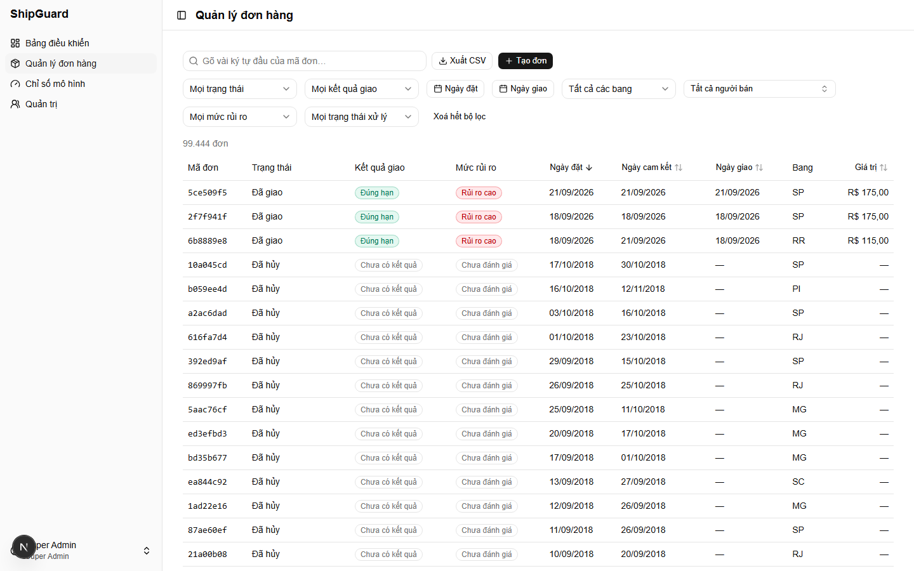

| STT | Thành phần | Chức năng |
| --- | --- | --- |
| 1 | Ô tìm kiếm | Tìm đơn hàng theo mã đơn |
| 2 | Bộ lọc | Lọc theo trạng thái đơn, kết quả giao, khoảng ngày đặt/giao, bang, người bán, mức rủi ro, trạng thái xử lý |
| 3 | Xuất CSV | Tải danh sách đơn đang lọc ra tệp CSV |
| 4 | Tạo đơn hàng mới | Chuyển sang màn hình tạo đơn hàng mới |
| 5 | Bảng danh sách đơn hàng | Hiển thị mã đơn, trạng thái, kết quả giao, mức rủi ro, ngày đặt/dự kiến/giao, bang, giá trị đơn — sắp xếp được theo từng cột |
| 6 | Phân trang | Chuyển trang hoặc nhảy đến một trang cụ thể |

### 3.1.4. Tạo đơn hàng mới

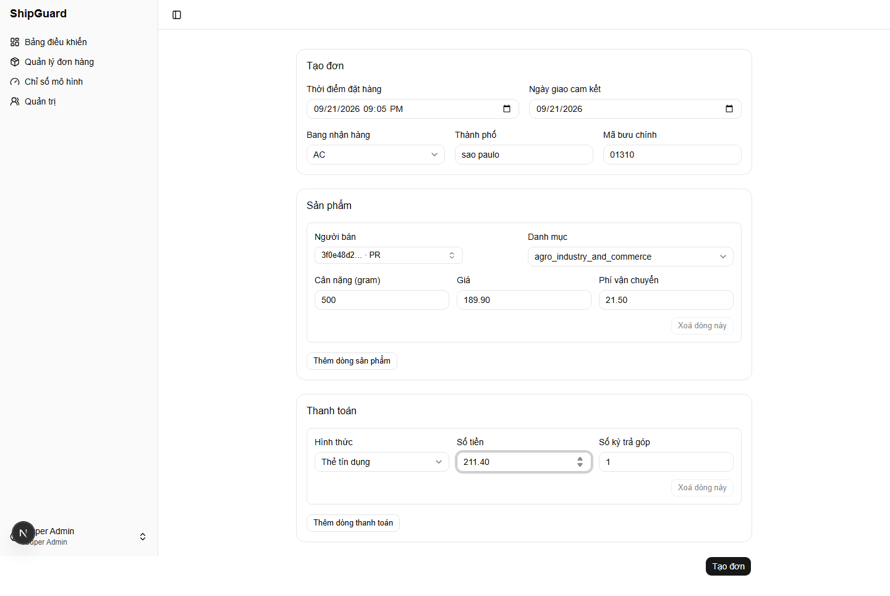

| STT | Thành phần | Chức năng |
| --- | --- | --- |
| 1 | Thông tin đơn hàng | Nhập thời điểm đặt hàng, ngày giao dự kiến, bang/thành phố/mã bưu chính khách hàng |
| 2 | Danh sách sản phẩm | Thêm/xoá từng dòng sản phẩm: người bán, danh mục, khối lượng, đơn giá, phí vận chuyển |
| 3 | Danh sách thanh toán | Thêm/xoá từng dòng thanh toán: hình thức, số tiền, số kỳ trả góp |
| 4 | Thông báo lỗi | Hiển thị lỗi nhập liệu — ví dụ ngày đặt ở tương lai, ngày giao trước ngày đặt, thiếu số liệu bắt buộc |
| 5 | Tạo đơn hàng | Xác nhận tạo đơn, chuyển sang trang chi tiết đơn vừa tạo |

### 3.1.5. Chi tiết đơn hàng

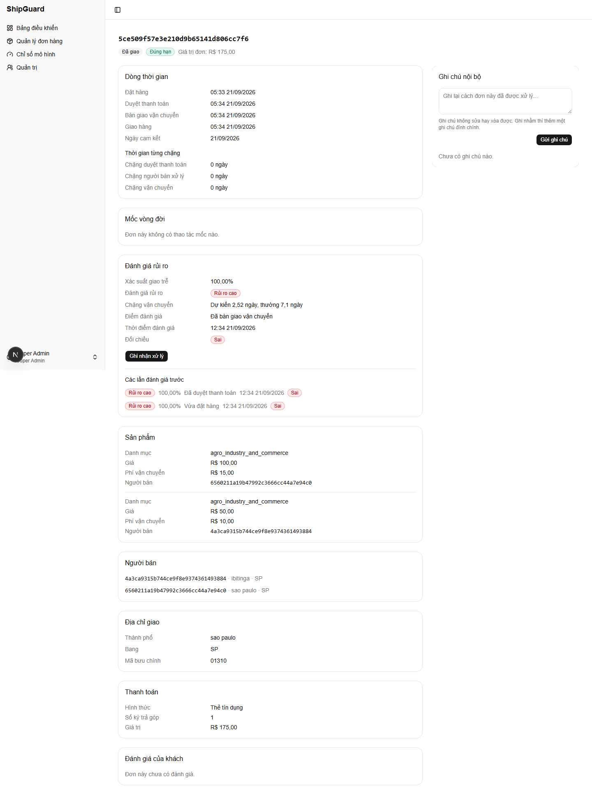

| STT | Thành phần | Chức năng |
| --- | --- | --- |
| 1 | Trạng thái đơn hàng | Hiển thị trạng thái hiện tại và kết quả giao (đúng hạn/trễ) |
| 2 | Giá trị đơn hàng | Hiển thị tổng giá trị đơn |
| 3 | Dòng thời gian vòng đời | Hiển thị thời điểm đặt hàng, duyệt thanh toán, bàn giao vận chuyển, giao hàng và thời gian từng chặng |
| 4 | Sản phẩm | Danh sách sản phẩm trong đơn |
| 5 | Người bán | Danh sách người bán tham gia đơn |
| 6 | Địa chỉ giao hàng | Bang, thành phố, mã bưu chính của khách hàng |
| 7 | Thanh toán | Danh sách các lần thanh toán của đơn |
| 8 | Đánh giá của khách hàng | Điểm và nhận xét đánh giá, nếu có |

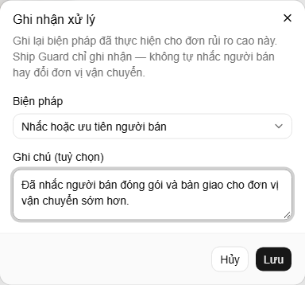

| STT | Thành phần | Chức năng |
| --- | --- | --- |
| 1 | Biện pháp | Chọn loại biện pháp can thiệp đã thực hiện cho đơn rủi ro cao |
| 2 | Ghi chú | Ghi chú thêm về cách xử lý (tuỳ chọn) |
| 3 | Lưu | Xác nhận ghi nhận biện pháp can thiệp |

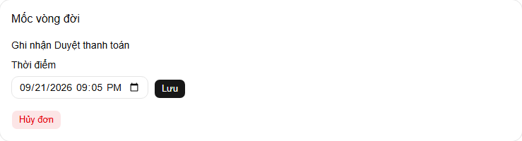

| STT | Thành phần | Chức năng |
| --- | --- | --- |
| 1 | Ghi nhận mốc vòng đời | Ghi nhận mốc kế tiếp trong vòng đời đơn hàng |
| 2 | Huỷ đơn hàng | Huỷ đơn hàng, có hộp thoại xác nhận trước khi thực hiện |

| STT | Thành phần | Chức năng |
| --- | --- | --- |
| 1 | Xác nhận huỷ đơn | Xác nhận huỷ, không hoàn tác được |
| 2 | Giữ đơn | Đóng hộp thoại, không huỷ |

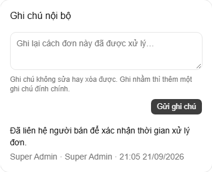

| STT | Thành phần | Chức năng |
| --- | --- | --- |
| 1 | Danh sách ghi chú | Xem các ghi chú nội bộ đã ghi cho đơn, mới nhất trước |
| 2 | Thêm ghi chú | Nhập và lưu một ghi chú nội bộ mới cho đơn |

## 3.2. Giao diện quản trị

### 3.2.1. Quản lý tài khoản người dùng

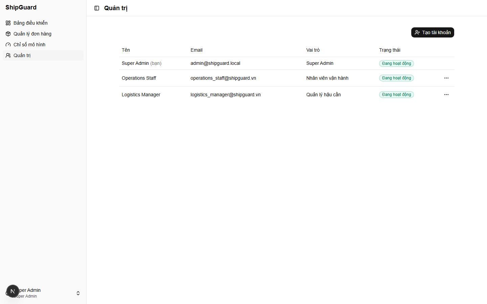

| STT | Thành phần | Chức năng |
| --- | --- | --- |
| 1 | Thêm người dùng | Mở hộp thoại tạo tài khoản mới |
| 2 | Bảng danh sách tài khoản | Hiển thị tên, email, vai trò, trạng thái (đang hoạt động/đã khoá) của từng tài khoản |
| 3 | Nhãn "bạn" | Đánh dấu dòng của chính tài khoản đang đăng nhập |
| 4 | Menu hành động | Mở danh sách thao tác cho một tài khoản — chỉ hiện với tài khoản người gọi được phép quản lý |

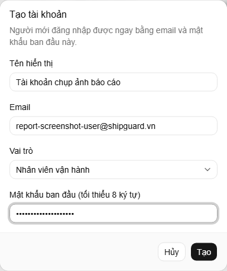

| STT | Thành phần | Chức năng |
| --- | --- | --- |
| 1 | Tên hiển thị | Nhập tên hiển thị của tài khoản mới |
| 2 | Email | Nhập email đăng nhập |
| 3 | Vai trò | Chọn vai trò — chỉ liệt kê vai trò người tạo được phép cấp |
| 4 | Mật khẩu | Đặt mật khẩu ban đầu cho tài khoản |
| 5 | Tạo | Xác nhận tạo tài khoản |

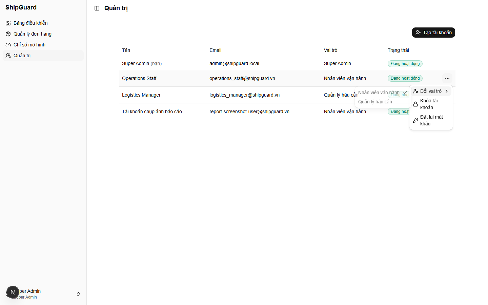

| STT | Thành phần | Chức năng |
| --- | --- | --- |
| 1 | Đổi vai trò | Mở danh sách vai trò để chọn vai trò mới — chỉ hiện khi người đang đăng nhập là Super Admin |
| 2 | Khoá / Mở khoá tài khoản | Khoá hoặc mở khoá quyền đăng nhập của tài khoản |
| 3 | Đặt lại mật khẩu | Mở hộp thoại đặt mật khẩu mới cho tài khoản |

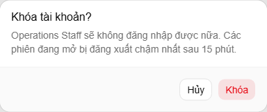

| STT | Thành phần | Chức năng |
| --- | --- | --- |
| 1 | Xác nhận khoá | Xác nhận khoá tài khoản, tài khoản bị đăng xuất khỏi mọi phiên đang dùng |
| 2 | Huỷ | Đóng hộp thoại, không khoá |

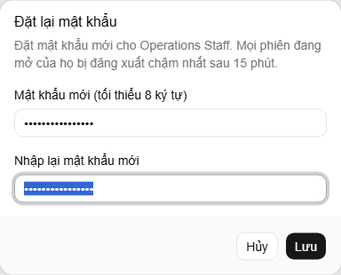

| STT | Thành phần | Chức năng |
| --- | --- | --- |
| 1 | Mật khẩu mới | Nhập mật khẩu mới cho tài khoản |
| 2 | Xác nhận mật khẩu | Nhập lại để xác nhận đúng mật khẩu mới |
| 3 | Lưu | Xác nhận đặt lại mật khẩu, tài khoản bị đăng xuất khỏi mọi phiên đang dùng |

### 3.2.2. Chỉ số độ tin cậy mô hình

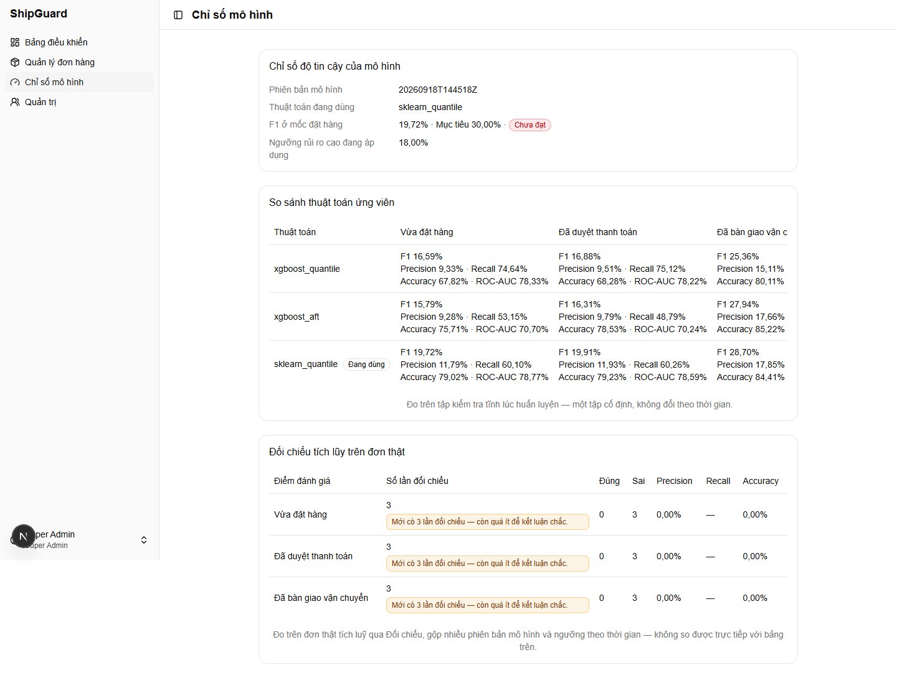

| STT | Thành phần | Chức năng |
| --- | --- | --- |
| 1 | Thông tin mô hình | Hiển thị phiên bản mô hình và thuật toán đang dùng để dự đoán |
| 2 | F1 tại thời điểm đặt hàng | So sánh điểm F1 đạt được với mục tiêu đề ra, đánh dấu đạt/chưa đạt |
| 3 | Ngưỡng rủi ro | Hiển thị ngưỡng xác suất dùng để xếp đơn vào mức rủi ro cao |
| 4 | Bảng so sánh thuật toán | So sánh F1/Precision/Recall/Accuracy/ROC-AUC giữa các thuật toán đã thử, theo từng mốc vòng đời |
| 5 | Bảng đối chiếu thực tế | Đối chiếu dự đoán với kết quả giao hàng thật theo từng mốc — tổng số, số đúng/sai, các chỉ số kèm cảnh báo khi mẫu quá nhỏ |
